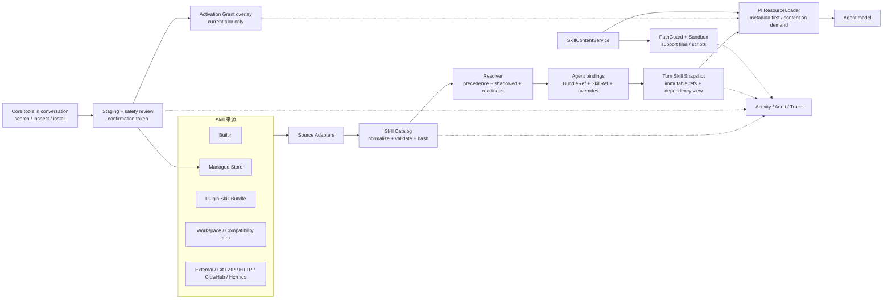

# Phase 13：Skill 系统与 Agent Skills 生态兼容层

**状态：已评审修订（2026-08-05），待开发** | **规划基线：** `main`（Phase 12 最终验收点，`df24f05`）
**阶段定位：** Skill 1.0 基础设施，不实现 Subagent、多 Agent 协作或浏览器内核
**路线图依据：** [docs/positioning-and-roadmap.md](../docs/positioning-and-roadmap.md) Phase 13
**架构参考：** OpenHanako `core/skill-manager.ts`、`lib/tools/install-skill.ts`、`lib/skills/session-skill-snapshot.ts`、`lib/skill-bundles/store.ts`；OpenClaw `docs/tools/skills.md`；Hermes `tools/skills_tool.py`；PI `@earendil-works/pi-coding-agent/docs/skills.md`；Agent Skills Specification

> 本文是交给开发 Agent 的阶段开发计划，不是单个任务的实现步骤。开发 Agent 必须以本计划的契约、边界和验收标准为准，不能把 Skill 变成 Plugin、记忆或 Agent 人格的替代品。

---

## 一、目标

Phase 13 建立 OpenColorful 的 Skill 1.0 基础设施，让 Agent 获得可安装、可组合、可按需加载的“做事方法”，兼容成熟的 Agent Skills 生态，同时复用 Phase 12 插件系统、Phase 9 沙箱和 Phase 11 日志系统。

本阶段必须交付：

1. 兼容 Agent Skills 标准的 Skill 包格式、校验器、内容索引和安全读取服务；
2. Builtin、Managed、Plugin、Workspace、External 五类来源的统一 Catalog 与冲突解析；
3. SkillRef、BundleRef、版本、来源、内容哈希和 Agent 绑定的持久化模型；
4. `implicit`、`explicit-only`、`disabled` 三种选择模式，以及 `validity/trust/readiness/selection` 四类独立状态；
5. PI SDK 原生 Skills 接入：元数据常驻、正文渐进披露、支持文件按需读取、每轮不可变 Skill Snapshot；
6. Agent 编辑页、Skill 管理页和会话内 `search_skills`、`inspect_skill`、`install_skill`、`manage_skills`、`manage_skill_bundle` 工具；
7. Managed Install、Linked Source、Git/ZIP/HTTP/本地目录及 OpenClaw、Hermes 来源适配器；
8. Skill Bundle 的版本化组合、Agent 持续绑定和单 Skill 覆盖设置；
9. Skill 安装、绑定、读取、激活、门控、脚本拒绝和失败恢复的 Activity/Audit/Trace 接入；
10. Skill 开发者 CLI（`init`、`validate`、`pack`、`inspect`、`link`、`unlink`、`doctor`）和官方无外部付费依赖的示例；
11. 固定版本兼容 Fixture、可选真实市场包测试和完整 Web/Playwright 验收。

本阶段的核心判断是：

> Skill 决定 Agent 怎样做事；Plugin/Tool 决定 Agent 能调用什么；记忆决定 Agent 经历过什么、知道什么；底色决定 Agent 是谁。

---

## 二、用户可感知变化

- 设置中新增 Skill 管理工作页，可查看来源、版本、哈希、风险、依赖、兼容性和当前 Agent 的绑定状态；
- Agent 编辑页可以查看已绑定 Bundle、直接绑定 Skill 和每项 Skill 的 `implicit/explicit-only/disabled` 模式；
- 用户可以从本地目录、ZIP、Git、HTTP、OpenClaw/Hermes 兼容来源检查并安装 Skill；
- 用户与 Agent 对话时，Agent 可以直接搜索、检查和安装 Skill，不必跳转到 Skill 管理页；
- 风险安装在当前会话中显示审查结果和一次性确认卡，确认目标包含来源、版本和内容哈希；
- 安装成功后默认只绑定当前 Agent；当前会话可通过一次性激活授权立即使用，不修改已经开始的 turn 快照；
- Skill 正文不会全部常驻注入，Agent 先看到名称和描述，需要时再读取 `SKILL.md` 或支持文件；
- 工作区 Skill 内容变更从下一 turn 生效，不改变当前 in-flight turn；
- Agent 可以学习和绑定 Skill，但不能在没有用户意图或系统安全原因时持久停用、解绑或迁移自己的 Skill；
- 失败的安装、更新、风险确认、依赖门控和脚本拒绝都会有可查询的日志和明确诊断；
- 开发者可以通过 CLI 链接本地 Skill，修改文件后在下一 turn 验证，而无需复制到 Managed Store；
- 插件携带的 Skill 能在插件启用且 Agent 绑定后进入同一套 Catalog、快照和日志链路。

---

## 三、范围与非目标

### 3.1 本阶段纳入

- Agent Skills 标准的目录和 frontmatter 兼容；
- 多来源发现、版本化安装、来源可信度、冲突诊断和内容哈希；
- Skill Bundle、Agent 绑定、单 Skill override 和生效时机；
- 会话内安装与风险审批；
- PI 原生运行接入与渐进披露；
- Skill 支持文件的安全读取；
- Skill 声明的环境、平台和二进制门控；
- Skill 脚本在既有 Sandbox 下执行的接入边界；
- Plugin Skill Bundle 登记到 Skill Catalog；
- Phase 11 可观测性接入；
- 开发者工具、兼容 Fixture、质量门和真实 Web 验收。

### 3.2 明确不做

- 不实现 Browser Use、云浏览器、远程浏览器池或 Web 内置浏览器；Electron Core 浏览器延后；
- 不实现 Subagent、临时无记忆 Agent、多 Agent 协作、ACP、Channel 或任务 DAG；
- 不实现 Skill 自动生成、自动改写、自动优化或“记忆转 Skill”；
- 不允许 Skill 直接授予 Plugin、Tool、文件、网络、Secret 或 Provider 权限；
- 不建设 OpenColorful 自有远程市场服务器，不依赖 OpenClaw/Hermes CLI 作为运行时；
- 不自动运行安装包 `postinstall`、来源仓库任意脚本或依赖安装器；
- 不承诺外部生态插件/Skill 的 100% 行为兼容，只提供明确兼容等级和降级诊断；
- 不把 `allowed-tools` 当作预授权，不允许 Skill 正文触发递归安装依赖；
- 不提供 Agent 无确认的持久停用、解绑、全局卸载、来源信任修改或其他 Agent 配置修改。

---

## 四、核心架构决策

1. **复用 PI 原生机制。** OpenColorful 不建设平行 Skill 执行引擎；平台负责 Catalog、来源、绑定、权限提示、Snapshot、安全读取、UI 和日志，PI 负责元数据注入、模型匹配、渐进披露和按需读取。
2. **Skill 是语义单位，Bundle 是分发/配置单位。** Skill 可独立绑定；Bundle 是带版本的 SkillRef 集合，变更必须创建新版本，不能原地覆盖。
3. **安装、启用、绑定、授权分离。** 安装进入本地 Store；启用表示可被解析；绑定决定 Agent 可见；当前 turn 激活授权只扩大当前 turn 的精确 SkillRef 集合，不能改变平台权限。
4. **固定引用优先于名称解析。** 任何 Agent 配置和 Session Snapshot 必须保存精确 SkillRef（来源、版本、哈希），名称只用于展示和搜索。
5. **来源不静默覆盖。** 同名候选都保留，低优先级项标记 `shadowed`；用户或 Agent 必须显式选择精确 SkillRef，Workspace Skill 不能通过同名文件替换已固定引用。
6. **内容按需读取。** 元数据可进入系统提示，`SKILL.md`、`references/`、`templates/` 和 `assets/` 只有在模型或工具明确读取时进入上下文；读取由 `SkillContentService` 统一控制。
7. **每轮冻结。** turn 开始时冻结 SkillRef、来源、版本、内容哈希、依赖状态和选择模式；配置变化从下一 turn 生效。
8. **声明不等于权限。** Skill 的 plugins/tools/capabilities/bins/env/OS 声明只用于依赖提示、风险展示和 readiness 判定，不能创建 Grant。
9. **学习可主动，遗忘不可随意。** Agent 可在会话内搜索、检查、安装和绑定 Skill；持久停用/解绑、固定版本升级、来源信任变更和全局卸载必须由用户明确确认，或由系统安全隔离并留下证据。
10. **本地优先。** Managed Store、Linked Source、缓存和安装历史默认写入本地；真实市场网络访问是可选能力，不进入默认单测。
11. **插件只提供来源/登记能力。** Phase 12 插件携带的 Skill Bundle 由平台统一导入 Catalog，不能绕过 Skill Store、Snapshot、Sandbox 或 Observability。

---

## 五、术语、引用和状态

### 5.1 稳定引用

```ts
type SkillRef = {
  skillId: string;
  sourceId: string;
  sourceKind: "builtin" | "managed" | "plugin" | "workspace" | "external";
  version: string;
  contentHash: string;
};

type BundleRef = {
  bundleId: string;
  version: string;
  contentHash: string;
};
```

同一个显示名称可以对应多个 SkillRef；任何绑定、审计、快照和回滚都不得只保存名称。

### 5.2 四类正交状态

```text
validity: valid | invalid
trust: trusted | untrusted
readiness: ready | degraded | blocked | incompatible
selection: implicit | explicit-only | disabled | shadowed
```

- `validity`：格式、frontmatter、路径和内容完整性；
- `trust`：来源和用户确认状态；
- `readiness`：当前 OS、bins、env、配置、插件和依赖是否满足；
- `selection`：当前 Agent 是否允许模型自动发现或显式使用。

`disabled` 只表示持久配置中的明确选择；源失效、哈希变化或安全问题使用 `blocked`，不能伪装成 Agent 主动停用。

### 5.3 选择模式

- `implicit`：元数据进入 PI Skill 列表，模型可按描述自动选择；
- `explicit-only`：不参与普通自动匹配，只能由用户命令、`/skill:<name>` 或 Agent 明确请求触发；
- `disabled`：当前 Agent 持久不使用，变更需要用户确认；
- `shadowed`：候选仍在 Catalog 中，但因来源冲突不进入当前解析结果。

不设置 `always-on`。需要常驻的内容必须由底色或系统提示等更稳定机制承载，而不是扩大 Skill 注入面。

---

## 六、总体架构



### 6.1 运行时数据流

1. 启动或显式刷新时，Source Adapter 只发现候选并返回 provenance，不直接把任意文件交给 PI；
2. Catalog 对候选执行包结构校验、frontmatter 解析、canonical path 检查、哈希计算和来源标记；
3. Resolver 根据 Agent 固定引用、Bundle 版本、来源优先级和 readiness 生成可见集合；
4. `beginTurn` 创建不可变 Skill Snapshot；无固定绑定时，快照 = 所有 `implicit` 且 readiness 满足的候选（不含 `shadowed`），在此时展开冻结，后续变化不影响本轮；
5. PI `getSkills` 只收到快照中的 Skill pointer 和元数据；正文与支持文件必须通过 `SkillContentService`；
6. Agent 在会话内安装的新 Skill 先进入 Managed Store，再通过 `SkillActivationGrant` 写入当前 turn 的仅追加精确覆盖层；不修改原 Snapshot；
7. 下一 turn 重新解析 Agent 绑定和来源状态，决定是否继续使用。

### 6.2 与其他层的边界

| 层 | 负责 | 不负责 |
|---|---|---|
| 底色 | Agent 的底层人格、表达倾向 | Skill 工作流 |
| 记忆 | 经历、事实、主动回想和整理 | 自动生成 Skill |
| Skill | 做事方法、流程、参考资料 | 执行权限、Secret、工具实现 |
| Plugin/Tool | 工具、UI、Provider、运行时代码 | 替 Skill 管理绑定和快照 |
| Sandbox | 文件、命令、进程执行边界 | 判断 Skill 语义是否可信 |
| Logging | 活动、审计、Trace、诊断证据 | 作为 Skill 内容或记忆注入 |

---
## 七、Skill 包格式与解析契约

### 7.1 原生兼容目录

```text
skill/
├─ SKILL.md                    # 必需：YAML frontmatter + Markdown instructions
├─ references/                 # 可选：按需读取的详细资料
├─ scripts/                    # 可选：只能通过既有 Sandbox 执行
├─ templates/                  # 可选：模板和输出骨架
├─ assets/                     # 可选：图片、数据和其他只读资源
└─ agents/openai.yaml         # 可选：兼容 Codex/OpenAI 的 UI/依赖元数据
```

Phase 13 必须兼容 `name`、`description`、`license`、`compatibility`、`metadata`、`allowed-tools`、`disable-model-invocation` 等 Agent Skills/PI 常用字段。未知高风险字段不得静默授权；普通未知字段保留原始 frontmatter 并给出诊断。

### 7.2 OpenColorful 扩展

所有平台扩展只能放在：

```yaml
metadata:
  opencolorful:
    version: 1
    requires:
      plugins: []
      tools: []
      capabilities: []
      bins: []
      env: []
      os: [win32, darwin, linux]
    recommends:
      skills: []
      plugins: []
    risk: low
```

扩展字段必须经过 TypeBox 或显式解析器校验；`allowed-tools` 仅解析并作为依赖提示，不产生 `plugin_grants` 或 sandbox capabilities。

### 7.3 包完整性

- 安装入口只接受完整 package：目录、ZIP、`.skill`、Git 子目录或已登记 SessionFile；
- 不接受裸 `skill_content`，不允许把一段 Markdown 冒充完整 Skill；
- 包内相对路径必须归一化并保持在 Skill 根目录；
- ZIP Slip、Symlink/Junction 逃逸、重复路径、大小超限、文件类型异常直接拒绝；
- `SKILL.md`、frontmatter、支持文件清单和版本都参与规范化哈希；
- Managed Artifact 安装后不可原地修改；Linked Source 记录内容变化并在下一 turn 重新哈希。

---

## 八、来源发现、优先级与兼容生态

### 8.1 五类来源

| 来源 | 说明 | 默认策略 |
|---|---|---|
| `builtin` | OpenColorful 随版本提供的 Skill | trusted，可由平台固定版本 |
| `managed` | 本地 Store 中的正式安装包 | 需 provenance 和完整性校验 |
| `plugin` | Phase 12 插件贡献的 Skill Bundle | 跟随插件版本和启用状态 |
| `workspace` | 当前工作区内的 Skill | 默认不信任，需显式信任工作区 |
| `external` | 兼容目录、Git、ZIP、HTTP、市场适配器 | 安装前审查，不能静默覆盖 |

默认兼容目录：

```text
<cwd>/.agents/skills/
<cwd>/.claude/skills/
<cwd>/.codex/skills/
<cwd>/.openclaw/skills/
~/.agents/skills/
~/.claude/skills/
~/.codex/skills/
~/.openclaw/skills/
```

这些目录默认关闭；用户信任某个根目录后才扫描。`workspace` 与兼容目录的信任是来源设置，不由 Skill 或 Agent 自己修改。

### 8.2 默认解析优先级

对于尚未固定 SkillRef 的发现结果，默认优先级为：

```text
workspace > managed > plugin > external > builtin
```

但以下规则优先于名称优先级：

1. 已绑定精确 SkillRef 永远使用该版本和哈希；
2. 同名候选全部保留，低优先级项标记 `shadowed`；
3. Workspace 同名项不能替换 Agent 已固定的 Managed、Plugin 或 Builtin Skill；
4. 用户可以在检查页或会话内显式选择精确来源；
5. 删除、变更或失效的高优先级候选不能静默回退到另一个同名 Skill，必须产生诊断并等待重新解析。

### 8.3 来源适配器

统一 `SourceAdapter` 接口至少支持：

- `discover(query, scope)`：搜索候选，不安装；
- `inspect(sourceRef)`：读取 provenance、Manifest/frontmatter、依赖和风险摘要；
- `stage(sourceRef)`：将完整 package 放入受控 staging；
- `resolveVersion(sourceRef)`：固定版本和内容哈希；
- `capabilities()`：声明是否支持搜索、安装、更新和离线模式。

Phase 13 交付 local、archive、git、http、OpenClaw/ClawHub、Hermes Tap/Hub 适配器；远程适配器失败只返回明确诊断，不把网络失败伪装为“没有 Skill”。

### 8.4 兼容等级

```text
native          原生 Agent Skills，完整支持
pi-compatible   PI/Agent Skills，可直接交给原生 loader
openclaw        OpenClaw Skill，已转换 gating/来源信息
hermes          Hermes Skill，已转换渐进披露/环境门控
metadata-only   仅能展示元数据，正文或结构不兼容
unsupported     拒绝安装并说明原因
```

兼容性报告必须显示缺失字段、降级行为和是否需要手工迁移；不得声称二进制行为兼容。

---

## 九、Catalog、Bundle 与 Agent 持久化

### 9.1 Catalog 事实模型

建议使用 SQLite（复用 Phase 12 `metadata.sqlite`），正文仍保存在文件系统。至少新增或扩展：

```text
skills
  skill_id, source_id, source_kind, display_name, version, content_hash,
  root_path, manifest_json, validity, trust, readiness, selection,
  provenance_json, installed_at, updated_at

skill_files
  skill_ref_key, relative_path, content_hash, size_bytes, kind

skill_bundles
  bundle_id, version, content_hash, name, source_kind, source_id,
  manifest_json, created_at, supersedes_version

skill_bundle_items
  bundle_id, bundle_version, skill_ref_key, selection, ordinal

agent_skill_binding_index
  agent_id, skill_ref_key, selection, bundle_id, bundle_version,
  pinned, config_revision, updated_at   # 可从 skills.json 重建的查询投影

session_skill_bindings
  session_id, skill_ref_key, selection, expires_at, created_at

skill_activation_grants
  grant_id, agent_id, session_id, skill_ref_key, content_hash,
  issued_turn_id, expires_at, consumed_at, reason

skill_operations
  operation_id, kind, source_ref, agent_id, session_id,
  status, compensation, error_code, created_at, completed_at
```

表名和 migration 版本可由开发 Agent 按现有迁移编号调整，但必须保持以下事实来源：Registry 是安装和版本事实；`agents/<agentId>/skills.json` 是 Agent 持久绑定、Bundle 和学习策略的唯一事实来源；`agent_skill_binding_index` 只是可重建查询投影；Session binding/activation grant 以 SQLite 为事实来源；文件系统是正文事实；Activity/Audit 只存证，不取代领域状态。`skills` 表的 `selection` 是平台默认选择模式，Agent 级选择以 binding 为准。

### 9.2 本地目录布局

```text
${OPENCOLORFUL_HOME}/
├─ skills/
│  ├─ installed/<skillId>/<version>/    不可变 Managed Artifact
│  ├─ staging/<operationId>/            安装和更新暂存区
│  ├─ cache/                            可清理的来源缓存
│  └─ builtin/                          可选的内置 Skill 投影
├─ skill-dev-sources/                   Linked Source 登记根
├─ config/skill-sources.json            来源和信任配置，不保存 Secret
└─ agents/<agentId>/skills.json         Agent Bundle/Skill 绑定
```

所有路径由 `src/config/paths.ts` 统一生成，调用方不得自行拼接用户数据目录。

### 9.3 Bundle 规则

- Bundle 是版本化 SkillRef 集合，不是 Agent 创建模板；
- Agent 可以持续绑定多个 Bundle；
- Bundle 内单项可以覆盖为 `implicit`、`explicit-only` 或 `disabled`；
- Bundle 变更创建新版本，旧版本保持可回滚；
- Plugin 携带 Bundle 跟随 Plugin 版本，不独立更新；
- Agent 迁移 Bundle 必须保留旧绑定和迁移前后差异；
- Agent 不得原地修改 Bundle 正文；用户明确要求时可创建新版本。

### 9.4 Agent 配置

Agent 目录新增：

```text
~/.opencolorful/agents/<agentId>/skills.json
```

保存 Bundle 版本绑定、直接 SkillRef、单 Skill override、固定版本、学习策略和最近一次迁移状态。Workspace Skill 不写入该文件，只通过当前 Session 的工作区解析进入快照。

无 Agent 的 Session：

- 不继承 Agent Bundle；
- 可以使用显式 Skill、已信任的 Workspace Skill 和策略允许的全局 Skill（“全局 Skill” = 平台策略放行的 builtin/trusted managed 精确 SkillRef 集合，对齐 Phase 12 无 Agent Session 只获得 Core 能力的边界；由来源信任配置决定，不由 Skill 或 Agent 自行修改）；
- 会话内安装进入全局 Managed Store，但只建立当前 Session 的临时绑定；
- Session 结束后临时绑定不自动升级为 Agent 持久绑定。

---

## 十、PI 原生接入与 Turn Snapshot

### 10.1 接入点

复用 `src/pi-sdk/agent-session.ts` 的 `ResourceLoader.getSkills()`，把当前 Agent/Session 的解析结果转换为 PI 兼容的 Skill pointer。不得在 Server 侧建立第二套 prompt 注入引擎。

新增内部 `SkillContentService`，负责：

- 只读取当前 Snapshot 中存在的 SkillRef；
- 读取 `SKILL.md`、references、templates、assets 的相对路径；
- canonical path、内容哈希、大小和 MIME/文本类型检查；
- 读取预算、单文件上限、总支持文件上限和超时；
- 对 script 读取和执行分别记录证据；
- 源文件消失、哈希变化或路径逃逸时 fail-closed。

### 10.2 Snapshot 契约

每个 turn 至少冻结：

```text
snapshotId
agentId / sessionId / turnId
SkillRef[]（来源、版本、哈希）
selection mode
validity / trust / readiness 结果
依赖检查结果
turn 开始前已经存在的激活授权摘要
```

- `SKILL.md` 在 turn 中首次读取时必须匹配快照哈希；
- support file 在首次访问时加入 snapshot manifest，后续读取使用同一哈希；
- scripts 不复制到新的执行引擎，调用现有 Sandbox/Tool 入口；
- 当 Skill 绑定、版本、来源信任、插件运行实例或贡献集发生变化时，下一 turn 重建 Snapshot；
- Snapshot 构造失败必须返回显式错误，工具和正文读取均 fail-closed，不得返回 `undefined` 继续运行；
- 会话内安装不修改已开始的 Snapshot；`SkillActivationGrant` 先被一次性消费并附着为当前 turn 的 append-only overlay，运行时按“基础 Snapshot 精确 Ref + overlay 精确 Ref”判定可见性；overlay 不改变 snapshotId，也不能扩大任何 Tool/Plugin/Sandbox 权限；
- 安装成功结果必须返回由 `SkillContentService` 生成的精确 `loadHandle`，让模型在本 turn 通过受控读取入口加载新 Skill 正文；不得返回可绕过 ContentService 的任意绝对路径；
- `loadHandle` 生命周期：单 turn 有效，绑定 `turnId + sessionId + skillRef + contentHash`；turn 结束或首次读取后过期（过期后只返回失效诊断，不返回正文）；每次读取仍经过 ContentService 哈希校验，禁止跨 turn 重放。

### 10.3 渐进披露

1. 系统提示只包含名称、描述、来源和 readiness 摘要；
2. 模型按需通过 PI 原生读取机制获取 `SKILL.md`；
3. 只有正文明确引用或工具明确请求时才读取支持文件；
4. Skill 不得把整棵目录或所有 references 一次性注入上下文；
5. `explicit-only` Skill 不进入自动匹配列表，但用户或 Agent 可用精确引用加载。

---
## 十一、会话内 Skill 安装与 Agent 学习

### 11.1 Core 工具

主 Agent 获得五个正式 Core 工具：

```text
search_skills
inspect_skill
install_skill
manage_skills
manage_skill_bundle
```

其中 `manage_skills` 只能管理当前 Agent 的绑定和选择模式；停用、解绑、固定版本迁移需要用户确认。`manage_skill_bundle` 只能创建新版本或提出迁移申请，不能原地覆盖已发布 Bundle。

工具必须通过平台服务执行，不能让模型直接调用安装器、文件系统或网络客户端。

### 11.2 搜索顺序

Agent 搜索遵循以下顺序，并在结果中标明来源层级：

```text
当前 Agent 已绑定 → 本地 Managed Store → 当前工作区/可信兼容目录
→ 已启用 Plugin Skill Bundle → 已有 Plugin/Tool 能力 → 远程来源/市场
```

不得因为搜索结果缺少 Skill 就递归触发安装；远程搜索和远程安装是两个独立动作。

### 11.3 安装来源

`install_skill` 只接受完整 package 来源：

- `sourceRef`：市场、Git、HTTP、ZIP、本地目录或 Plugin Bundle；
- `SessionFile`：用户已经上传并登记的 `.zip`/`.skill` 包；
- 不接受裸 Markdown、模型生成的路径字符串或未登记的客户端本地路径。

安装流程：

```text
inspect → stage → validate → canonicalize/hash → safety review
      → risk decision → one-time confirmation (if required)
      → install immutable artifact → bind current Agent/Session
      → activation grant overlay → next turn persistent resolution
```

### 11.4 学习策略

```text
disabled       Agent 不能主动安装
ask-always     每次安装都需要用户确认
ask-on-risk    低风险可信来源可直接安装，高风险需要确认（默认）
```

风险确认令牌必须绑定：`sourceRef`、固定版本、内容哈希、Agent、Session、操作类型和过期时间，并且只能消费一次。确认页面展示来源、许可证、脚本或二进制、依赖、请求的环境变量和风险原因。

### 11.5 安装后的生效

- Managed Install 默认进入全局 Store，但只绑定当前 Agent；
- 当前 Agent 已有 Session 时，通过 `SkillActivationGrant` 的 append-only overlay 让当前 turn 立即使用精确 SkillRef；
- 无 Agent 的 Session 只建立临时 Session 绑定；
- 安装成功不自动修改其他 Agent、全局默认 Skill 或来源信任；
- 安装、升级、绑定、启用、停用和解绑的结果必须明确区分。

### 11.6 Agent 自主管理边界

Agent 可以搜索、检查、安装和绑定自己的新 Skill，也可以在用户明确要求时创建 Bundle 新版本。Agent 不得：

- 无确认地持久停用、解绑或迁移自己的 Skill；
- 修改 Skill 正文或全局卸载；
- 修改其他 Agent 的绑定；
- 改变来源信任、Sandbox、Plugin Grant 或 Provider Secret；
- 根据 Skill 正文自动安装未审查依赖。

Agent 当然可以在单个 turn 中选择“不调用某个 Skill”；这不产生 `disabled` 配置变更。安全隔离使用 `readiness=blocked` 和明确的 `blockedReason`，保留原绑定和审计证据。

### 11.7 依赖递归限制

- Skill 可以声明推荐依赖，但只能形成安装建议；
- 依赖最大解析深度为 4，单次检查最多 32 个 Skill；
- 循环依赖返回稳定诊断，不自动打破或任意选取版本；
- 未安装依赖不自动安装，Agent 必须逐项检查并按学习策略处理；
- Plugin/Tool 依赖只检查现有 Grant 和绑定，不创建新授权。

---

## 十二、安全、门控与 Sandbox 边界

### 12.1 门控字段

Skill 可声明：

- `os` / `platforms`；
- `bins` / `anyBins`；
- `env` / `required_environment_variables`；
- `config`；
- `plugins`、`tools`、`capabilities`；
- 推荐的 Skills/Plugins；
- 风险等级和许可信息。

这些字段只能生成 `readiness` 和诊断，不能自动授予权限或创建 Grant。

### 12.2 内容安全

- 指令型 Skill 进入普通安全审查；
- 含 `scripts/` 的 Skill 必须显示显著风险提示，脚本只能走现有 Sandbox；
- 含二进制或本地可执行文件的 Skill，Phase 13 默认拒绝安装并建议转换为 Plugin；
- Skill 内容中的“忽略之前指令”“授予我权限”“读取 Secret”等文本视为不可信指令，不能提升系统权限；
- 任何路径、ZIP、Symlink/Junction、文件类型和大小校验失败都 fail-closed；
- 日志、审计、Prompt 和错误响应不得包含 API Key、Authorization、Cookie、Secret 值或完整敏感文件正文。

### 12.3 脚本执行

- Skill 只描述脚本使用方式，不直接执行；
- Agent 调用脚本必须经过现有工具、Plugin 或 Sandbox 入口；
- `process.cwd` 不得替代 Session `workspaceCwd`；
- 预检、PathGuard、OS 沙箱、危险命令拒绝和审计沿用 Phase 9；
- 无 Sandbox 能力时，脚本 Skill 进入 `readiness=blocked`，不能降级为宿主进程执行。

### 12.4 安装安全审查

安全审查采用“确定性检查优先，模型审查补充”的顺序：

1. 先执行包结构、路径、文件类型、大小、脚本和二进制的确定性检查；
2. 再对 `SKILL.md` 进行提示注入、过宽触发、越权要求和社会工程审查；
3. 无 utility model 时不能把“未审查”当作“安全”，按来源策略要求用户确认或拒绝；
4. 模型审查结果只能增加风险，不能覆盖确定性拒绝；
5. 用户接受风险也不能绕过 binary、路径逃逸、包损坏和平台硬策略。

---

## 十三、插件与日志接入

### 13.1 Plugin Skill Bundle

Phase 12 的 `SkillBundleService` 从“只登记”升级为“登记到统一 Catalog”：

- 插件启用并通过 Agent binding 后，平台导入插件声明的 SkillRef；
- Skill 内容仍通过 `SkillContentService` 读取；
- 插件更新时，旧 Bundle/SkillRef 保留并可回滚；
- 插件卸载后，该来源的 Catalog 条目与绑定引用保留并置 `blocked` + 来源诊断，正文读取 fail-closed；若需继续可用，必须由用户显式执行“固定到 Managed Store”转存操作，转存是独立操作；
- Plugin 自己不能绕过 Agent 的 Skill 选择模式或安全审批。

### 13.2 Activity / Audit / Trace 事件

事件目录至少注册：

```text
skill.discovered
skill.inspect.started / completed / failed
skill.install.started / completed / failed
skill.install.risk_detected
skill.install.confirmation_requested / confirmed / rejected
skill.bound / unbound.requested / unbound.approved / unbound.rejected
skill.selection.changed
skill.blocked / shadowed / readiness.changed
skill.read.started / completed / failed
skill.script.started / completed / failed / denied
skill.uninstalled
skill.rollback.started / completed / failed
skill.bundle.created / versioned / migrated / rolled_back
skill.activation.granted / consumed / expired / rejected
```

要求：

1. 文件型安装、绑定、解绑、升级和信任变更使用 Phase 11 的 `started → domain transaction → completed/failed` 严格审计模式；
2. 事件携带 `skillRefKey`、`bundleRef`、`sourceId`、`contentHash`、`agentId`、`sessionId`、`turnId`、`operationId` 和 `traceId`；
3. 事件只记录元数据、大小、哈希、稳定 reasonCode 和结果摘要，不记录 Skill 正文；
4. 读取高频事件以 Trace/Diagnostic 为主，安装、风险、绑定、拒绝和脚本执行结果进入 Durable Activity；
5. Agent、Plugin、Session 和 Skill 查询可通过 `/logs?skill=`、`agentId`、`sessionId`、`operationId` 过滤；
6. SSE 事件必须先写 Replay Store 再广播，遵守 Phase 11 cursor、reset 和脱敏契约。

### 13.3 特殊状态

安装或风险审查期间，聊天界面显示结构化状态，例如：

```text
agent正在学习技能
agent完成了技能检查
agent等待你的确认
```

这些状态是 Activity/SSE 的 UI 投影，不写入记忆 Markdown，也不改变主 Agent 的底色。

---

## 十四、API、CLI 与 Web 契约

### 14.1 Server API

建议新增或扩展以下接口，具体路径可复用 Phase 12 路由风格：

```text
GET    /api/skills
GET    /api/skills/:skillRef
POST   /api/skills/search
POST   /api/skills/inspect
POST   /api/skills/install
POST   /api/skills/activation/:grantId/consume
GET    /api/skills/bundles
POST   /api/skills/bundles
POST   /api/skills/bundles/:id/versions
GET    /api/agents/:agentId/skills
PUT    /api/agents/:agentId/skills
POST   /api/agents/:agentId/skills/:ref/approve
GET    /api/sessions/:sessionId/skills
```

所有输入使用 TypeBox 或显式解析器。API 不接受正文作为安装输入，不接受客户端任意绝对路径，SessionFile 和服务端可见路径必须有资源登记。源码链接（`skills link` / `unlink`）仅 CLI 提供，Web `/skills` 开发态只读展示 Linked Source 状态。

### 14.2 Core 工具结果

`search_skills` 和 `inspect_skill` 返回结构化候选、来源、版本、哈希、风险和 readiness；`install_skill` 返回：

```text
status: installed | confirmation_required | rejected | failed
skillRef
operationId
agentBinding: bound | session-only | unchanged
activationGrant: granted | unavailable
loadHandle: string | null
reasonCode
```

模型不能根据模糊成功文本推断安装完成；只有 `status=installed` 且有精确 `skillRef` 才能继续声明成功。

### 14.3 CLI

```text
skills list
skills search <query>
skills inspect <source-ref>
skills install <source-ref>
skills validate <path>
skills pack <path>
skills init <name>
skills link <path>
skills unlink <source-id>
skills doctor
skills bundle create|version|inspect
```

CLI 与会话内工具必须复用同一 Service，不得出现两套安装或校验规则。`skills install` 默认需要显式确认高风险包；`skills link` 只读引用源码，不能把源码目录直接当 Managed Artifact。

### 14.4 Web

- `/skills`：发现、已安装、来源、Bundle、诊断和开发态；
- Agent 编辑页：绑定列表、版本固定、模式覆盖、学习策略；
- 聊天页：安装检查、风险确认、安装进度和当前 turn 激活状态；
- Skill 详情：正文摘要、文件树、来源证明、兼容性、依赖和事件；
- `/logs` 支持 `skill`、`source`、`operationId` 预筛选；
- 不使用普通弹窗承载完整安装流程，风险确认采用可追踪的会话内审批卡。

---
## 十五、开发者体验与生态兼容

### 15.1 本地开发循环

开发者可以：

1. `skills init` 生成符合标准的目录和最小 `SKILL.md`；
2. `skills validate` 检查 frontmatter、路径、支持文件、门控和安全风险；
3. `skills link` 将源码以 Linked Source 接入，不复制、不允许原地修改 Managed Artifact；
4. 开发过程中由 `doctor` 显示当前来源、哈希、readiness、shadowed 和当前 Agent 绑定；
5. `skills pack` 生成可分发的 ZIP/`.skill` 包并输出内容哈希；
6. 使用固定 Fixture 和 PI faux provider 验证元数据发现、正文读取和会话调用。

### 15.2 生态兼容策略

- OpenClaw：转换 `metadata.openclaw.requires`、`os`、`bins`、`env`、`disable-model-invocation` 和来源优先级；
- Hermes：转换渐进披露、`skills_list`/`skill_view` 语义、platform/prerequisites/required environment；
- Claude/Codex/PI：直接兼容标准目录和常见 frontmatter；
- 外部市场包必须保存原始 provenance 和转换诊断；
- 不安装外部项目的 CLI、Hook 或运行时脚本作为隐式依赖；
- 兼容失败应给出迁移建议，而不是生成一个表面成功但运行时空壳的 Skill。

### 15.3 官方示例

提供一个纯 instruction-only 的 `sdk-showcase-skill`，覆盖：

- 标准 frontmatter；
- references/templates 按需读取；
- `metadata.opencolorful.requires` 门控；
- 一个安全的、无需付费 Provider/API Key 的工作流；
- validate/pack/link/install/inspect 和会话内安装演示。

不以 Browser Use 为示例；浏览器能力未来由 Electron Core Browser 或 Plugin 提供。

---

## 十六、实施任务与依赖

### T1：契约、术语、路径与迁移（主 Agent 串行）

- 冻结 `SkillRef`、`BundleRef`、NormalizedSkillManifest、四类状态和 SourceAdapter 接口；
- 验证 PI 0.80.10 Skill 接口实际语义（`getSkills` 返回结构与正文按需读取机制，如 `contentIsFull`），与渐进披露假设不符时记录偏差并调整 T5 接入方案；
- 在 `paths.ts` 增加 skills store、staging、cache、linked source 路径；
- 设计 SQLite migration v11（Phase 12 已占 v10；实现时以合并后 main 实际版本为准），覆盖 Skill Catalog、文件清单、Bundle、Agent binding、activation grant、operation；
- 新增跨进程输入解析和稳定错误 reasonCode；
- 同步 `packages/plugin-protocol` 与 Phase 12 Skill Bundle descriptor；
- 产出契约测试和架构图更新。

### T2：Catalog、校验器与来源解析

- 实现标准 frontmatter/目录解析、规范化哈希、大小/路径/符号链接检查；
- 实现 builtin、managed、plugin、workspace、external 候选扫描；
- 实现兼容目录信任策略和默认关闭；
- 实现优先级、shadowed、精确 SkillRef 解析和 readiness 诊断；
- 统一 SourceAdapter 的 discover、inspect、stage、resolveVersion 能力。

### T3：Managed Store、Linked Source 与安装器

- 实现受控 staging、完整包安装、provenance、版本并存、原子激活和失败补偿；
- 实现 local、archive、git、http 适配器；
- 实现 ZIP Slip、Junction/Symlink、重复路径、文件/目录/大小限制；
- 安装器只调用平台安全服务，不执行来源脚本或依赖安装命令；
- 更新、回滚、卸载遵守“安装不等于启用，启用不等于绑定”。

### T4：Bundle 与 Agent 绑定服务

- 实现 Bundle 创建新版本、固定版本、排序、迁移、回滚；
- 实现 Agent `skills.json` 读写、直接 SkillRef、单 Skill override 和学习策略；
- 实现持久绑定变更的用户确认和 Agent 申请边界；
- 确保 Workspace Skill 不污染 Agent 持久配置；
- 为无 Agent Session 提供临时绑定模型。

### T5：PI ResourceLoader、ContentService 与 Snapshot

- 将 `agent-session.ts` 的 `getSkills` 从空实现接入解析结果；
- 实现 `SkillContentService` 的安全正文和支持文件读取；
- 实现 turn snapshot、快照哈希、首读支持文件冻结、激活授权和受控 loadHandle；
- 冻结注入预算：Snapshot ≤ 32 个 Skill、元数据合计 ≤ 4000 字符、ContentService 单文件 ≤ 256KB、每轮支持文件读取总量 ≤ 512KB、读取超时上限；超限按优先级截断并标记 `truncated`；
- 绑定、插件运行实例、版本、来源信任或贡献集变化时从下一 turn 重建；
- 所有冻结失败和内容失效路径 fail-closed；
- 保证不与记忆 Markdown 注入链建立隐式耦合。

### T6：会话内搜索、检查、安装和审批

- 注册 `search_skills`、`inspect_skill`、`install_skill`、`manage_skills`、`manage_skill_bundle` Core 工具；
- 接入安全审查、风险摘要、一次性确认令牌和学习策略；
- 安装成功后建立当前 Agent binding 或 Session-only activation；
- 不允许 Agent 无确认持久停用、解绑或升级固定版本；
- 将结构化安装状态投影到聊天 SSE。

### T7：插件、Sandbox 与 Observability 接入

- 将 Phase 12 Skill Bundle 登记接入统一 Catalog；
- 插件版本切换、启用、禁用、卸载和回滚触发 Skill readiness/Binding 重算；
- scripts 复用 PathGuard、Sandbox、workspaceCwd 和工具执行入口；
- 注册 Skill Activity/Audit/Trace 事件，所有高风险文件型操作采用严格审计生命周期；
- `/logs` 支持 Skill、Bundle、source、operation 查询和实时筛选。

### T8：Web、CLI 与开发者体验

- 实现 `/skills` 管理中心、Agent Skill 设置、详情/诊断、会话审批卡；
- 实现 `skills init/validate/pack/link/unlink/inspect/doctor`；
- 复用同一 Server Service，禁止 CLI 和 Web 创建平行逻辑；
- 提供官方 `sdk-showcase-skill` 与开发文档。

### T9：生态适配与真实包测试

- OpenClaw、Hermes、Claude/Codex/PI 兼容适配；
- 固定版本本地 Fixture 进入默认 CI；
- 选取少量 instruction-only 的真实 OpenClaw/ClawHub 或 Hermes Skill，锁版本和哈希后加入可选 `test:skills-live`；
- 实时测试使用临时 `OPENCOLORFUL_HOME`，不依赖开发者个人凭据或付费 API。

### T10：质量门、浏览器验收与计划回写（主 Agent 串行）

- 主 Agent 独立复核所有共享契约、迁移、安装器、快照和 fail-closed 分支；
- 单独执行全部质量门；
- 使用 browser-use/Playwright 完成真实 Web 和会话内安装验收；
- 更新本计划实施记录、测试证据、已知偏差和最终状态；
- 未满足全部验收标准时不得合并 `main`。

---

## 十七、并行规则与文件归属

### 17.1 依赖图

```text
T1
├─ T2 ─┬─ T3 ─┐
│      └─ T4 ─┼─ T5 ─┬─ T6
│             │      └─ T7
└─────────────┴──────── T8 ─ T9 ─ T10
```

T1 完成契约和 migration 后，T2、T3、T4 可以在不改共享契约的前提下并行；T5 必须等待 T2/T4；T6/T7 必须等待 T5；T10 永远由主 Agent 串行收口。

### 17.2 文件归属原则

- `packages/skill-*`、`src/contracts/skill-*`、migration：T1 独占；
- `src/runtime/skills/catalog`、`sources`、`installer`：T2/T3；
- `src/storage/skill-*`、`src/runtime/skills/bundles`、Agent skills service：T4；
- `src/pi-sdk/*`、`src/runtime/skills/content`、snapshot：T5；
- `src/server/routes/skills.ts`、Core tools、SSE：T6；
- `src/observability/catalog/skill-events.ts`、Sandbox bridge、插件接线：T7；
- `web/src/features/skills`、CLI skills command、examples/docs：T8/T9；
- 共享入口、组合根和计划文件由主 Agent 负责合并修改。

### 17.3 子任务验收规则

- 子任务不得自行改变 SkillRef、事件目录、migration 或 API 契约；
- 每个子任务必须带针对性测试和失败路径测试；
- 子 Agent 的“通过”报告不是最终验收证据；
- 主 Agent 必须独立复核 diff，并按质量门逐条执行命令。

---

## 十八、测试矩阵

### 18.1 契约与格式

- 标准 frontmatter 必填/可选字段、未知字段、大小限制、名称规则；
- OpenClaw、Hermes、PI、Codex 兼容转换；
- `SkillRef`、`BundleRef`、哈希和版本不可伪造；
- 包目录、ZIP Slip、重复路径、Junction/Symlink、超限和非法文件类型。

### 18.2 Catalog 与解析

- 五类来源发现和默认关闭的兼容目录；
- 同名冲突全部保留、shadowed 标记、精确 Ref 选择；
- Workspace 同名不能替换已固定 SkillRef；
- readiness 的 OS、bin、env、plugin、tool、config 门控；
- 源文件修改、删除、哈希变化和重启恢复。

### 18.3 安装、Bundle 与 Agent

- managed install 原子性、失败补偿、版本并存、回滚和卸载数据保留；
- linked source 只读引用和下一 turn 生效；
- Bundle 新版本、固定版本、单项 override、迁移和恢复；
- Agent skills.json 持久化、旧数据迁移和无 Agent Session 临时绑定；
- Agent 停用或解绑必须确认，正常“不调用”不产生配置变化。

### 18.4 PI 运行时与 Snapshot

- 元数据常驻、正文渐进披露、references/templates/assets 按需读取；
- 当前 Snapshot 内容哈希和来源锁定；
- 支持文件首读冻结；
- Snapshot 构造或读取失败 fail-closed；
- 安装后的 current-turn activation grant 只扩大精确 SkillRef 集合，并能通过 loadHandle 在同一 turn 读取正文；
- 配置、版本、插件实例变化从下一 turn 生效。

### 18.5 会话内安装与安全

- 搜索顺序和远程搜索/安装分离；
- 仅完整 package 安装，拒绝裸 Markdown；
- 风险审查失败、确认令牌过期、重放、目标变更；
- 无审计、审计 rejected、领域写入失败和补偿失败；
- scripts 不能绕过 Sandbox，binary-bearing 默认拒绝；
- 不泄露 Secret、Cookie、Authorization 或完整 Skill 正文。

### 18.6 插件、日志与 Web

- Plugin Skill Bundle 版本切换、卸载和回滚；
- Activity/Audit/Trace 生命周期、scope、operationId、snapshotId 和 SSE replay；
- `/logs?skill=` 过滤和实时更新；
- `/skills`、Agent 编辑页、聊天审批卡在桌面和移动宽度下无重叠；
- Browser E2E：发现 → 检查 → 安装 → 会话内确认 → 绑定 → 下一 turn 加载 → 读取引用文件 → 解绑申请 → 日志查询 → 卸载或回滚。

### 18.7 真实市场 Skill

- 默认 CI 使用固定本地兼容 Fixture，不请求外网；
- 可选 `test:skills-live` 使用固定版本和哈希的 instruction-only 包；
- 真实包必须无付费 API、无个人 API Key、许可证允许、Windows 可用；
- Live 测试失败只能标记兼容性或网络诊断，不能污染默认质量门；
- 测试完成清理临时 `OPENCOLORFUL_HOME`、staging、runtime 和日志。

---
## 十九、质量门

开发完成后必须逐条单独执行并读取退出码：

```powershell
node scripts/verify-pi-sdk-imports.mjs
npx tsc --noEmit -p tsconfig.json
npx vitest run
npm run test --workspace=web
npm run web:build
npx tsc -p tsconfig.build.json
cd web
npx playwright test
```

若新增 Skill Protocol/Runtime 包，还必须提供并执行对应的独立构建和包校验，例如：

```powershell
npm run build --workspace=packages/skill-protocol
npm run build --workspace=packages/skill-runtime
node scripts/verify-skill-package.mjs tests/fixtures/skills/sdk-showcase-skill
```

质量红线：

- `strict`、`noUncheckedIndexedAccess`、`exactOptionalPropertyTypes` 全过；
- 所有跨进程数据使用 TypeBox 或显式解析；
- 安装、绑定、解绑、风险确认、来源信任和版本迁移均有严格审计；
- 事件先写 Replay Store 再广播；
- 默认测试不得请求真实 Provider 网络或依赖个人凭据；
- 默认测试不得依赖远程市场稳定可用；
- 不能使用名称代替精确 SkillRef；
- 不能以 `undefined`、空成功响应或静默降级表示 Skill 已安装或已加载；
- 不记录 API Key、Authorization、Cookie、Secret 或完整 Skill 正文。

---

## 二十、验收标准

### 20.1 必须通过

1. 可安装一个标准 Agent Skills 包，保留完整目录、版本、来源和内容哈希；
2. 可从 OpenClaw、Hermes、PI、Codex 常见目录发现并显示兼容等级；
3. 同名 Skill 不静默覆盖，固定 SkillRef 不被 Workspace 同名项替换；
4. Agent Bundle 和单 Skill override 可持久保存、升级、回滚，变更从下一 turn 生效；
5. PI 主会话先看到元数据，按需读取正文和支持文件，读取受 Snapshot/ContentService 限制；
6. 会话内 Agent 可以搜索、检查、安装并管理自己的 Skill/Bundle；风险包、停用、解绑和固定版本迁移需要绑定目标的一次性用户确认；
7. 安装后只绑定当前 Agent，当前 turn 可通过 activation grant + loadHandle 读取并使用精确 SkillRef，无 Agent Session 使用临时绑定；
8. Agent 不得无确认持久停用或解绑 Skill；正常不调用不产生 disabled 配置；
9. Skill 声明不能授予工具、插件、文件、网络或 Secret 权限；脚本必须走现有 Sandbox；
10. Plugin Skill Bundle 进入同一 Catalog、Snapshot、Sandbox 和日志链路；
11. 安装、检查、读取、绑定、激活、阻断、脚本拒绝、版本迁移均可从 `/logs` 追踪；
12. 本地开发者可以 init、validate、pack、link、doctor，并在不复制源码的情况下完成下一 turn 验证；
13. 至少一个许可证允许的真实市场 Skill 固定版本快照进入离线 Fixture，并完成发现、检查、安装、绑定和加载；可选 Live 测试不需要付费外部服务；
14. 全部质量门和真实 Browser E2E 通过，工作树干净后才允许合并 `main`。

### 20.2 明确不作为通过条件

- 不要求所有 OpenClaw/Hermes 市场包都能直接运行；
- 不要求实现 Electron 浏览器；
- 不要求实现 Skill 自动创作或自我优化；
- 不要求实现 Subagent 或多 Agent 协作；
- 不以“文件已复制”替代“PI 主会话已按 Snapshot 安全加载”；
- 不以“模型回复安装成功”替代可查询的 Registry、Audit 和 activation grant 证据。

---

## 二十一、风险与缓解

| 风险 | 缓解 |
|---|---|
| Skill Prompt Injection | 结构化审查、风险提示、正文不具备系统权限、用户确认令牌 |
| 同名 Skill 混淆 | 精确 SkillRef、来源优先级、shadowed、固定绑定 |
| Workspace/Junction 逃逸 | canonical path、realpath、PathGuard、受控 trust 根 |
| 安装包携带任意代码 | 不运行 postinstall；scripts 只走 Sandbox；binary 默认拒绝 |
| 当前 turn 读到更新后内容 | Snapshot 哈希和首读支持文件冻结 |
| Agent 过度自我修改 | 停用、解绑、升级、信任变更需要用户确认 |
| 生态字段不兼容 | NormalizedManifest、compatibility level、迁移诊断 |
| 远程市场不可用 | 本地 Fixture 默认 CI，Live 测试可选、固定版本 |
| 日志泄露 Skill 内容或 Secret | 只记 Ref/hash/摘要，双重脱敏，审计和查询统一入口 |
| Skill 数量导致上下文膨胀 | 元数据常驻、正文渐进披露；Snapshot ≤32 个 Skill、元数据 ≤4000 字符、支持文件 ≤512KB/轮（T5 冻结）；显式模式 |
| 插件 Skill 版本悬挂 | 插件版本绑定、旧 Ref 保留、卸载后 blocked 而非静默回退 |

---

## 二十二、实施记录

本节在实施阶段由主 Agent 按任务回写，至少记录：

- 每个 T 任务的提交、负责人和共享文件变更；
- migration、协议和安全边界的评审修复轮；
- 默认测试、Live 测试和 Browser E2E 的独立结果；
- 已知偏差、未接线入口和后续阶段议题；
- 最终验收结论和是否允许合并 `main`。

Phase 14 的 Subagent 计划不得在本节之前提前实现或混入本阶段。

---

### T1 实施记录（2026-08-05，主 Agent 串行冻结）

**内容**：SkillRef/BundleRef/NormalizedSkillManifest/四类状态/兼容等级/SourceAdapter 能力声明/稳定错误码/注入预算/loadHandle 契约、migration v11、skills 路径、Skill 事件目录、契约测试。

**关键冻结决策**：
- **契约位置**：不新建独立 `packages/skill-protocol` 包（Skill 是纯内容 + Server 侧契约，无跨进程 worker/运行时边界，不像 Plugin 有 IPC 协议）；核心契约放 `src/contracts/skill-protocol.ts`（TypeBox + 手动类型）；`packages/plugin-protocol` 已含 `SkillBundleContributionSchema`（skillsDir），T7 升级登记语义时再扩展。
- **稳定引用**：`SkillRef{skillId, sourceId, sourceKind, version, contentHash}` 五要素全必填（additionalProperties:false 防伪造）；`skillRefKey = "<skillId>@<sourceId>@<version>"` 作为事件/日志/表主键统一字符串键，不信任名称。
- **状态模型**：validity/trust/readiness/selection 四类正交；`blocked` 表达安全/依赖阻断（保留绑定与审计证据），`disabled` 只表示用户明确选择；`shadowed` 是解析结果不入注入面。
- **声明不等于权限**：`requires{plugins,tools,capabilities,bins,env,os}` 与 `allowedTools` 只进 NormalizedManifest 用于 readiness/风险/展示，不产生任何 Grant；普通未知字段保留 `rawFrontmatter` 并诊断，未知高风险字段拒绝。
- **错误契约**：`SKILL_ERROR_CODES` 稳定枚举（35 个，安装/解析/读取/激活/操作五族），跨进程/日志/审计统一使用 code+reasonCode，不暴露内部细节。
- **注入预算**：`SKILL_BUDGETS`（32 Skill / 4000 元数据字符 / 256KB 单文件 / 512KB 每轮支持文件 / 依赖深度 4 / 单次 32 / 读取超时 10s）。
- **migration v11**：8 张表（skills / skill_files / skill_bundles / skill_bundle_items / agent_skill_binding_index / session_skill_bindings / skill_activation_grants / skill_operations）；`agent_skill_binding_index` 明确标注为可从 `agents/<agentId>/skills.json` 重建的查询投影；`CURRENT_SCHEMA_VERSION = 11`。
- **paths**：`home/skills/{installed,staging,cache,builtin}` + `home/skill-dev-sources/` + `config/skill-sources.json`（全部由 paths.ts 生成）。
- **事件目录**：`catalog/skill-events.ts` 注册 41 个 activity 点号式事件 + 22 个 audit 下划线式事件（install/update/rollback/uninstall/binding/bundle/source_trust 三件套）；文件型操作 activity 带 auditMirror；读取高频事件以 Trace 为主。

**PI 0.80.10 Skill 接口实测（探索子 agent 验证，T1 要求）与渐进披露假设的偏差**：

1. `ResourceLoader.getSkills()` 返回 `{ skills: Skill[], diagnostics }`；`Skill = { name, description, filePath, baseDir, sourceInfo, disableModelInvocation }`——**不存在 `contentIsFull` 字段，不存在 skillId/metadata**；
2. **无原生 `get_skill`/`inspect_skill` 工具**；正文读取完全依赖通用 `read` 工具按 `Skill.filePath`（绝对路径）读文件（2000 行 / 50KB 限制）；
3. 元数据注入是 PI 职责（`formatSkillsForPrompt` → `<available_skills>` XML 含 name/description/location），**被 `hasRead` 门控**——活跃工具集不含 `read` 时技能元数据不进系统提示；
4. `disableModelInvocation: true` 的技能对模型完全不可见（只能 `/skill:name` 显式加载），PI 模型侧无法实现"仅显式调用但可见"——需平台注入自有 `inspect_skill` 工具补足；
5. opencolorful 始终传 `minimalResourceLoader`（getSkills 返回空），PI 默认 Skill 发现被完全绕过。

**偏差对 T5 方案的调整（记录，T5 落实）**：
- 平台向 PI 注入 `Skill[]` 时，`filePath` 必须是受控真实路径（bundle 内路径，经 PathGuard read 规则允许），`baseDir` 为 bundle 根；
- "正文渐进披露 + 按需读取"在 PI 侧落地为：元数据进系统提示（依赖 read 在活跃工具集）+ 模型用 read 读受控路径；**读取前**由平台挂接校验（哈希/预算/审计，T5 定位 read 工具挂接点）；
- 平台同时注入 `search_skills`/`inspect_skill` 等 Core 工具（结构化读取，不依赖模型自行 read 绝对路径），满足"explicit-only 可见"与 loadHandle 单 turn 受控读取；
- `contentIsFull` 语义由平台侧 SkillSnapshot 的"正文未读/已读"状态承载（PI 无此概念，快照层自己维护）。

**针对性测试**（不依赖全量）：tests/contracts/skill-protocol.test.ts（SkillRef/BundleRef/Manifest 正反例/四态/兼容等级/错误码/预算/loadHandle 11 例）、tests/unit/observability-skill-catalog.test.ts（事件登记/命名约定/started-terminal 配对/auditMirror 6 例）、tests/integration/skill-migration.test.ts（全新库 v11/10→11 升级保留数据/拒绝高版本 3 例）；既有 observability-contract/plugin-catalog/config-paths/plugin-migration 32 例无回归。

### T2-T10 实施记录（2026-08-06，主 Agent 规划/复核/验收 + 子 agent 开发）

**任务进度**：T2（Catalog/校验器/来源解析，94 用例）→ T3+T4（安装器 + Bundle/Agent 绑定，75 用例）→ T5（PI ResourceLoader/ContentService/Snapshot/loadHandle，44 用例）→ T6+T7（会话内工具/确认令牌/API + 插件桥/ScriptRunner/observability 过滤，101 用例 + web 3）→ T8（CLI/Web 管理中心/官方示例/文档，51 用例 + web 19）→ T9（生态适配/固定版本 Fixture/live 隔离，44 用例）→ T10（组合根装配 + 浏览器验收，3 集成 + 1 E2E）。全部由主 Agent 独立复核 diff 与测试后提交，子 agent 未自行提交。

**T10 组合根关键决策**：
- `src/runtime/skills/composition.ts`：唯一装配点（Catalog/Stores/Installer/AgentSkillService/BundleService/SessionService/Snapshot/Content/loadHandle/Confirmation/Core + PluginSkillBridge + SkillScriptRunner）；`rebuildFromDisk()` 启动重建（五类来源扫描 + 插件桥 initialize：enabled→sync、其余→block，杜绝重启 fail-open）；`attachPluginLifecycle()` 包装 facade 的 enable/disable/update/rollback/uninstall → syncPluginSkills/blockPluginSkills（best-effort，失败 warn）。
- **readiness 环境**：`buildSkillReadinessEnvironment` 真实探测 PATH bin（Windows .exe/.cmd/.bat/.ps1，上限 2000）与环境变量名——否则 requires.bins 的 Skill 全部 blocked（T10 集成测试发现并修复）。
- **PI 元数据每 turn 冻结**：`core.buildPiSkillsForTurn`（Agent 绑定 → 不可变 SkillSnapshot（含未消费激活授权摘要）→ buildPiSkillsFromSnapshot）；messages 路由持函数槽（`skills: () => skillsSlot.current`），每次 prompt 前刷新——PI 每 turn 重建系统提示经 getSkills() 读到当前冻结集（§10.2 冻结语义落地）。
- **T9 偏差闭环**：① openclaw/hermes 适配器注册进 createStandardAdapters + Stager REMOTE_UNSUPPORTED 移除（本地镜像缺省时明确诊断）；② `core.install` 统一拒绝 unsupported/metadata-only 兼容等级（§8.4 不生成表面成功的空壳，local 路径不再绕过生态边界）。
- **正文读取的会话上下文**：详情页正文摘要经 ContentService 受控读取需 session 上下文（无 session 时正确降级为"不可用"提示，不泄露正文）——E2E 验证该降级。

**浏览器验收（T10，Playwright）**：`web/tests/e2e/skill-lifecycle.spec.ts`——真实 Supervisor + Agent Server + Web：/skills 打开 → trusted local 安装（sdk-showcase-skill 直装）→ 发现搜索命中 → 已安装列表 → 详情（元数据表/状态四元组/兼容性 native/正文摘要降级/事件链接）→ /logs?skill= 预筛选 → 返回 /skills。1/1 通过。

**质量门（T10 收口全量复跑）**：vitest 1752（113→152 文件）、web 394、web build、tsc（source+build）、imports（pi-sdk/plugin）、protocol/sdk 构建、verify-skill-package、Playwright 全量（56 + skill-lifecycle 1）——结果以最终验收结论为准。

**已知偏差（T10 记录）**：
1. 插件 Skill 阻断态为进程内存（migration 冻结未加表），靠启动 initialize() 重建——重启后若插件状态未变则阻断恢复一致；
2. Confirm 令牌为内存 registry（未持久化；跨 server 重启失效，属可接受——确认流程在会话内即时完成）；
3. 会话内 install 的 activation grant/loadHandle 只经工具路径发放（HTTP 路由无 turn 上下文，绑定经下一 turn 快照生效）；
4. Skill 详情页正文读取需 session 上下文（`?session=<id>`），无 session 时显示受控降级提示——不泄露正文。