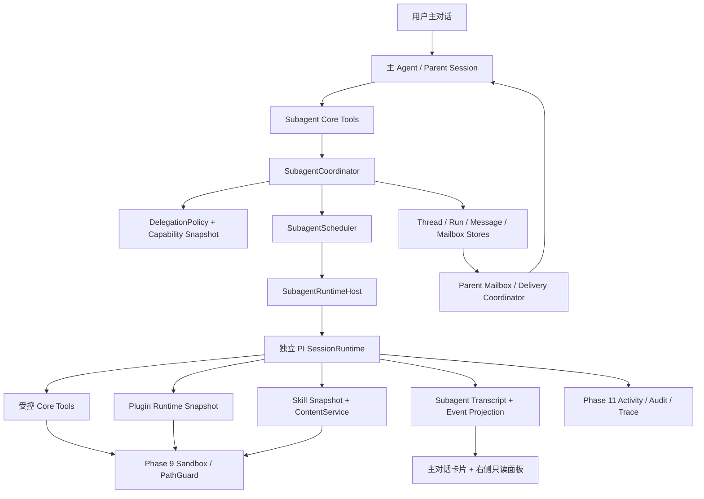

# Phase 14：临时 Subagent Runtime 与父子任务协议

**状态：已评审修订（2026-08-07），待开发** | **规划基线：** `main`（Phase 13 最终自审合并点，`90cae72`）
**阶段定位：** 临时、无长期记忆、可观察、可由主 Agent 多轮纠偏的 Subagent Runtime 1.0；不实现多 Agent 协作
**路线图依据：** [docs/positioning-and-roadmap.md](../docs/positioning-and-roadmap.md) Phase 14、[docs/infrastructure-decisions.md](../docs/infrastructure-decisions.md) 第四章
**架构参考：** OpenHanako `lib/subagent-thread-store.ts`、`lib/subagent-run-store.ts`、`lib/tools/subagent-tool.ts`、`lib/deferred-result-coordinator.ts` 与 Session Preview；Codex `AgentControl`、`InterAgentCommunication`、Agent Status Subscribe 与 Mailbox；OpenClaw child session completion/yield 与幂等结果投递；Hermes background delegation heartbeat；PI AgentSession `steer` / `followUp`；A2A 1.0 Task / Context / Message / Artifact 语义

> 本文是交给开发 Agent 的阶段开发计划，不是单个任务的实现步骤。开发 Agent 必须以本计划的协议、状态机、权限边界、持久化和验收标准为准。Subagent 是临时执行 Runtime，不是新建一个永久 Agent，也不是 Phase 15+ 多 Agent 团队、ACP 或图编排的提前实现。

---

## 一、目标

Phase 14 建立 OpenColorful 的 Subagent Runtime 1.0，使主 Agent 能把边界清晰的任务委派给一个临时、无长期记忆的子 Runtime，并在不阻塞主会话的情况下持续观察、纠偏、等待、取消和接收结果。

本阶段必须交付：

1. `SubagentThread` 与 `SubagentRun` 两层生命周期模型；
2. OpenColorful 内部强类型父子消息协议，并在数据模型上对齐 A2A 1.0；
3. 结构化任务说明 `SubagentTaskBriefV1`、上下文包 `SubagentContextPacketV1`、纠偏消息 `SubagentSteerV1` 与结果 `SubagentResultV1`；
4. 主 Agent 专用的 `spawn/get_status/inspect/steer/wait/cancel/close` Core 工具；
5. 可选择模型、Core Tools、Plugin、Skill、工作目录、Sandbox 和资源预算的能力快照；
6. 不注入底色、四段 Markdown 记忆或长期记忆工具的短期 PI Session Runtime；
7. 运行中 `queue` 与 `interrupt` 两种纠偏模式，映射 PI `followUp` 与 `steer`；
8. 父 Turn 结束后继续运行、父 Mailbox 持久结果投递、父 Session 生命周期联动；
9. 确定性的首事件、空闲、工具、总时长、迭代、Tool Call、Token 预算和 Runtime Lease 保护；
10. 进程重启后的 orphan recovery：活动 Run 标记 `interrupted`，未投递结果继续幂等补投递；
11. 主对话 Subagent 卡片和右侧只读观察面板；
12. 设置页 Subagent 默认模型；
13. Phase 9 Sandbox、Phase 11 Observability、Phase 12 Plugin、Phase 13 Skill 的完整接入；
14. 全链路单元、集成、故障注入和 Browser E2E 验收。

本阶段的核心判断是：

> Subagent 是主 Agent 临时创建的、没有长期记忆的受控执行 Runtime。它可以像主 Agent 一样思考、对话和使用被授予的工具，但没有永久身份，不能扩大权限，也不能创建更多 Agent。

---

## 二、用户可感知变化

- 主 Agent 可以在对话中创建一个或多个临时 Subagent 处理研究、审查、整理、编码或其他边界明确的任务；
- 主对话出现专门的 Subagent 卡片，显示标题、状态、模型、当前阶段、耗时、Token、最近活动和结果摘要；
- 用户点击卡片后，右侧侧边栏显示该 Subagent 的可见对话、工具行为、主 Agent 纠偏、运行状态、结果和 Artifact；
- 用户只能观察，不能在侧边栏直接向 Subagent 发消息、修改方向、授予权限或取消任务；
- 主 Agent 可以查看状态、检查最近行为、多轮纠偏、等待、取消和关闭 Subagent；
- Subagent 在父 Turn 结束后可以继续运行；完成、失败或需要输入时，主 Agent 会通过持久 Mailbox 收到消息；
- 父 Session 仍活跃时，终态结果或 `input_required` 可以可靠触发一次主 Agent 后续 Turn；
- 设置页可以指定 Subagent 默认模型；没有设置时，由主 Agent 创建时选择，通常继承主 Agent 当前模型；
- 设置变化只影响新建 Thread，已经创建的 Subagent 不会中途换模型；
- Server 重启后不会伪装继续执行旧 Run：旧活动 Run 明确显示为“已中断”，历史和结果仍可查看；
- `/logs?subagent=<threadId>` 可以查询该 Subagent 的创建、能力快照、执行、纠偏、超时、取消、投递和恢复记录。

右侧面板不得展示：

- 模型隐藏 Chain of Thought；
- 主 Agent 或 Subagent 的系统提示全文；
- API Key、Authorization、Cookie、Secret 或插件原始凭据；
- 未脱敏的工具参数、完整环境变量或受保护文件原文；
- 其他 Agent、其他 Session 或其他 Subagent 的内容。

---

## 三、范围与非目标

### 3.1 本阶段纳入

- 临时 Subagent 的创建、运行、观察、纠偏、等待、取消、关闭和恢复；
- 一个父 Agent / Session 对多个独立 Subagent Thread 的委派；
- 同一 Thread 内多轮 Run 和短期对话上下文；
- 父子结构化消息、持久 Mailbox 和结果补投递；
- 每个 Run 的模型、Core Tool、Plugin、Skill、Sandbox 与预算快照；
- 只读和显式写入两种工作区访问模式；
- PI Runtime 接入、`steer` / `followUp`、Faux Provider 无付费测试；
- Phase 11 Activity/Audit/Trace、SSE replay 和 `/logs` 过滤；
- Web 只读观察面板、设置项和真实浏览器验收。

### 3.2 明确不做

- 不实现永久 Subagent 身份、底色、人格、四段 Markdown 记忆、长期记忆或记忆 Agent；
- 不实现 Subagent 之间的横向通信、共享 Mailbox、群聊、Channel 或团队；
- 不允许 Subagent 创建 Subagent，最大嵌套深度固定为 1；
- 不实现 DAG、GraphRuntime、工作流编排、投票、竞争、共识或多 Agent 计划器；
- 不实现外部 A2A Server、Agent Card、远程认证、HTTP/JSON-RPC/gRPC Adapter；
- 不实现 ACP 常驻 Agent 或外部编码 Agent 进程托管；
- 不实现语义循环检测、重复 Tool Call 指纹、A-B-A-B 检测或 LLM 进度评分；
- 不实现自动多阶段纠偏、自动换模型、自动重启或静默降级；
- 不允许用户从右侧面板直接 steer、cancel 或 grant；
- 不允许自然语言消息扩大文件、网络、Plugin、Skill、Secret 或管理权限；
- 不把 Subagent transcript 自动写入长期记忆或四段记忆；
- 不在本阶段建设 Git Worktree 隔离或新的 OS 级沙箱后端。

---

## 四、核心架构决策

1. **Thread 与 Run 分离**：Thread 是用户可见的临时子 Agent 对话；Run 是 Thread 上一次实际模型执行。同一 Thread 的 Run 串行。
2. **没有永久身份**：Subagent 不进入 AgentStore，不拥有 identity/base-color/settings/memory 文件，不出现在 Agent 管理页。
3. **父级唯一归属**：每个 Thread 永久绑定唯一 `ownerAgentId + parentSessionId`；不能迁移、转交或跨 Session 复用。
4. **短期上下文可持续**：Thread 使用独立 PI Session transcript，多轮 Run 能继续上下文；关闭或父 Session 删除后不再可执行。
5. **结构化委派**：任务、纠偏、结果和输入请求使用 TypeBox 契约；自由文本只能出现在明确字段中，不能取代字段。
6. **内部协议先行**：Phase 14 实现进程内、store-first 的 `AgentMessageEnvelopeV1`；语义对齐 A2A，但不实现外部网络协议。
7. **用户观察、主 Agent 控制**：用户 UI 只读；所有 steer/wait/cancel/close 来自经过认证的父 Agent 工具上下文。
8. **父 Turn 与子 Run 解耦**：父 Turn 结束不取消子 Run；父 Session 归档、删除、Agent 归档或显式 stop 才触发生命周期联动。
9. **Run 内能力不可变**：模型、工具、Plugin、Skill、Sandbox、工作目录和预算在 Run 开始前冻结；自然语言纠偏不能改变。
10. **权限只会缩小**：有效能力 = 父级当前能力 ∩ Thread 创建请求 - 平台固定禁用；任何失败都 fail-closed。
11. **不做语义 watchdog**：只使用可确定测量的超时、预算、Lease 和进程存活信号。
12. **重启不自动续跑**：启动时把残留活动 Run 原子标记 `interrupted`；主 Agent 可以基于原 Thread 新开 Run，但平台不猜测是否应该继续。
13. **结果先落库再唤醒**：终态、结构化结果和父 Mailbox 通知在同一 SQLite 事务内写入，成功后才广播或触发父 Turn。
14. **高频流不污染父上下文**：普通对话、Tool Call 和 progress 只进入 Subagent 面板；父 Mailbox 仅接收关键状态。
15. **复用现有基础设施**：Runtime 复用 SessionRuntime/PI；权限复用 Sandbox/Plugin/Skill Snapshot；日志复用 Phase 11，不建立平行系统。

### 4.1 参考实现取舍

| 参考项目 | 采用 | 不采用 |
|---|---|---|
| OpenHanako | Thread/Run 分离、Deferred Result、父 Session 唤醒、只读 Session Preview、orphan 终态化 | 其项目专属 Prompt/Channel/身份模型 |
| Codex | AgentControl 工具族、状态订阅、Mailbox、queue/interrupt/close、结构化 Agent communication | 面向通用团队的横向通信和多层嵌套 |
| OpenClaw | child completion 单次投递、yield/announce 的幂等与 retry 思想、可见 child session | ACP、Channel binding 和常驻 child session |
| Hermes | heartbeat、current phase/tool、确定性 timeout 与后台状态展示 | 语义 stale/循环检测和复杂自动恢复策略 |
| PI | 真实 AgentSession、`steer`、`followUp`、Tool Event 和持久 transcript | 跨边界直接 import 内部实现 |
| A2A 1.0 | Context/Task/Message/Part/Artifact/Status 数据语义 | 外部网络 Server、Agent Card、认证和远程发现 |

OpenColorful 的组合不是对任一项目逐行复刻，而是用本项目已有 Sandbox、Plugin、Skill、Memory 隔离和 Observability 重新建立一致边界。

---

## 五、术语、身份与引用

### 5.1 核心对象

```text
Parent Agent       永久 Agent，拥有父 Session，唯一控制者
SubagentThread     临时子 Agent 对话与短期上下文容器
SubagentRun        Thread 上一次实际执行
TaskBrief          主 Agent 交给 Subagent 的结构化任务
ContextPacket      最小必要父上下文，不是完整会话复制
CapabilityCeiling Thread 创建时请求的最大能力边界
EffectiveSnapshot 某次 Run 实际冻结的模型/工具/插件/Skill/权限
ParentMailbox      子 Run 向父 Session 可靠投递关键状态的持久队列
Artifact           Run 产出的文本、数据或文件引用
RuntimeLease       证明某个进程仍实际持有 Run 的带过期租约
```

### 5.2 稳定 ID

```ts
type SubagentThreadId = `sat_${string}`;
type SubagentRunId = `sar_${string}`;
type AgentMessageId = `sam_${string}`;
type SubagentArtifactId = `saa_${string}`;
type ParentMailboxId = `smb_${string}`;
type SubagentSnapshotId = `sas_${string}`;
```

要求：

- 使用随机不可预测 ID，不允许客户端或模型自定义；
- `ownerAgentId`、`parentSessionId`、父 Turn 和父 Actor 从工具调用上下文获取，不从模型参数信任；
- 所有查询必须同时验证 Thread 归属，不能只凭 ThreadId；
- `contextId = SubagentThreadId`，`taskId = SubagentRunId`，与 A2A 语义对齐；
- 同一个 Thread 内的协议 `sequence` 严格单调、持久化、重启后不重复。

### 5.3 A2A 语义映射

```text
A2A contextId  -> subagentThreadId
A2A taskId     -> subagentRunId
A2A Message    -> AgentMessageEnvelopeV1
A2A Part       -> text / data / context_ref / artifact_ref
A2A Artifact   -> SubagentArtifact
A2A TaskStatus -> SubagentRunStatus + SubagentResultDisposition
```

Phase 15+ 若接入外部 A2A，只能通过 Adapter 映射，不得改写 Phase 14 的领域状态机或绕过权限快照。

---

## 六、总体架构



### 6.1 创建与执行数据流

```text
主 Agent 调用 spawn_subagent
  → 从当前工具上下文绑定 ownerAgent/session/turn
  → 校验 TaskBrief 与 ContextPacket 引用
  → 解析 Thread 模型
  → 计算 CapabilityCeiling
  → 严格审计委派
  → 同事务创建 Thread + task message + first Run
  → Scheduler 获得 Run
  → 重新与父级当前权限求交集
  → 冻结 EffectiveSnapshot
  → 创建/恢复 Thread PI Session
  → 执行结构化任务
  → transcript 与可观察事件实时投影
  → 终态 + result + mailbox 同事务落库
  → UI 广播，必要时唤醒父 Agent
```

### 6.2 与既有系统的边界

| 系统 | Phase 14 复用方式 | 明确禁止 |
|---|---|---|
| SessionRuntime / PI | 独立 Thread Session、模型循环、Tool Event、steer/followUp | 注册为普通用户 Session 或注入父完整历史 |
| Memory | 不接入 | 四段 md、search_memory、memory intent、后台整理 |
| Sandbox | 每 Run 生成并冻结策略、PathGuard、bash/tool preflight | 通过 TaskBrief 或 Plugin 绕过 |
| Plugin | 使用父 Agent 已绑定、已启用、已授权贡献的子集 | 安装、启停、升级、卸载、扩大 grant |
| Skill | 使用精确 SkillRef + contentHash 快照和受控读取 | 安装、解绑、停用、修改 Bundle |
| Observability | Actor/Executor/Scope/Trace、Activity/Audit、SSE replay | 复制 Prompt、Secret 或完整正文到日志 |
| AgentStore | 只引用父 Agent | 创建临时 Agent identity 或 settings |

---
## 七、Thread 与 Run 生命周期

### 7.1 Thread 状态

```ts
type SubagentThreadStatus = "open" | "closing" | "closed";
```

- `open`：允许查询、纠偏、等待，并在没有活动 Run 时创建下一 Run；
- `closing`：已请求关闭，正在取消活动 Run 和释放资源；
- `closed`：只读历史，不允许新 Run、steer 或能力变化。

Thread 创建后不会因单次 Run 结束自动关闭。这样主 Agent 可以查看结果后在同一短期上下文中继续纠偏。Thread 运行资源在每个 Run 终态后立即释放，Thread 元数据和 transcript 继续保留。

关闭规则：

- 主 Agent 调用 `close_subagent`：有活动 Run 时先进入 `closing`，取消成功后 `closed`；
- 父 Session 归档：所有 open Thread 进入关闭流程，保留只读 transcript；
- 父 Session 删除或父 Agent 删除：先取消，再删除 Thread transcript 和平台自有 Artifact；Activity/Audit 按日志保留策略保留；
- 父 Agent 仅暂时离线、浏览器关闭或父 Turn 结束：不关闭；
- open Thread 空闲 24 小时且没有活动 Run：自动关闭，保留历史；
- 自动关闭只释放继续执行资格，不删除 transcript。

### 7.2 Run 状态

```ts
type SubagentRunStatus =
  | "queued"
  | "starting"
  | "running"
  | "waiting_for_input"
  | "cancelling"
  | "succeeded"
  | "failed"
  | "cancelled"
  | "timed_out"
  | "interrupted"
  | "budget_exhausted";
```

终态集合：

```text
succeeded / failed / cancelled / timed_out / interrupted / budget_exhausted
```

合法主路径：

```text
queued → starting → running → succeeded
                     ├──────→ waiting_for_input → running
                     ├──────→ failed
                     ├──────→ timed_out
                     ├──────→ budget_exhausted
                     └──────→ cancelling → cancelled

queued/starting/running/waiting_for_input/cancelling
  └─ Server 重启或 Lease 丢失 → interrupted
```

约束：

- 同一 Thread 同时最多一个非终态 Run；
- 状态转换使用事务内 compare-and-set，非法转换抛稳定错误；
- 每个 Run 只能写入一个终态；重复 terminal 调用幂等返回已有结果；
- `waiting_for_input` 是活动状态，不等同于失败；
- `succeeded` 表示 Runtime 正常完成，业务结果仍由 `SubagentResultDisposition` 表达；
- `failed` 只能用于执行错误，不能用来表示“任务没有完全满足”；
- `interrupted` 不自动重试；主 Agent 检查后可以在原 Thread 新建 Run。

### 7.3 结果状态与运行状态分离

```ts
type SubagentResultDisposition =
  | "satisfied"
  | "partial"
  | "blocked"
  | "failed";

interface SubagentResultV1 {
  readonly disposition: SubagentResultDisposition;
  readonly summary: string;
  readonly criteria: readonly {
    readonly criterion: string;
    readonly status: "met" | "partial" | "unmet" | "unknown";
    readonly evidenceRefs: readonly string[];
  }[];
  readonly artifacts: readonly SubagentArtifactRef[];
  readonly unresolvedIssues: readonly string[];
  readonly recommendedNextAction: "accept" | "steer" | "ask_user" | "restart" | "stop";
}
```

示例：资料不足但 Subagent 正常分析完毕，应为 `run.status=succeeded + result.disposition=blocked`，而不是把 Runtime 标成失败。

字段上限：`summary` ≤ 2000 字符、`criteria` ≤ 20 项（`criterion` ≤ 200 字符、`evidenceRefs` ≤ 16）、`artifacts` ≤ 32、`unresolvedIssues` ≤ 20 项（每项 ≤ 500 字符）。

### 7.4 多轮规则

- 第一个 Run 由 `spawn_subagent` 创建；
- Run 活动时 `steer_subagent` 将结构化纠偏投递到当前 Run；
- Thread open 且最近 Run 已终态时，`steer_subagent` 创建下一 Run，并把纠偏作为新的结构化输入；
- `input_required` 后的有效回答恢复同一个 Run，不创建新 Run；
- 同一 Thread 默认沿用冻结模型、工作目录和 CapabilityCeiling；
- 每个新 Run 重新与父级当前有效权限求交集，权限撤销立即影响下一 Run；
- Thread 创建后不能扩大 CapabilityCeiling。需要更多权限时必须创建新的 Thread。

---

## 八、内部父子消息协议

### 8.1 Envelope

```ts
interface AgentMessageEnvelopeV1 {
  readonly protocol: "opencolorful.agent-message";
  readonly version: 1;
  readonly messageId: AgentMessageId;
  readonly contextId: SubagentThreadId;
  readonly taskId: SubagentRunId;
  readonly sequence: number;
  readonly sender: {
    readonly kind: "parent_agent" | "subagent" | "system";
    readonly id: string;
  };
  readonly recipient: {
    readonly kind: "parent_agent" | "subagent";
    readonly id: string;
  };
  readonly messageType:
    | "task"
    | "progress"
    | "steer"
    | "input_required"
    | "result"
    | "error"
    | "cancel"
    | "status";
  readonly deliveryMode: "immediate" | "queue" | "interrupt" | "mailbox";
  readonly correlationId?: string;
  readonly causationId?: AgentMessageId;
  readonly parts: readonly AgentMessagePartV1[];
  readonly metadata: {
    readonly createdAt: string;
    readonly traceId: string;
    readonly parentTurnId?: string;
    readonly schemaName: string;
  };
}
```

```ts
type AgentMessagePartV1 =
  | { readonly kind: "text"; readonly text: string }
  | { readonly kind: "data"; readonly schema: string; readonly value: unknown }
  | { readonly kind: "context_ref"; readonly ref: SubagentContextRefV1 }
  | { readonly kind: "artifact_ref"; readonly ref: SubagentArtifactRef };
```

### 8.2 Store-first 与幂等

- 消息必须先写 `subagent_messages`，提交后才交给 Runtime 或 Parent Mailbox；
- `messageId` 全局唯一，重复写入返回原记录，不重复执行副作用；
- Thread 行持有 `next_message_sequence`，在 SQLite 事务内分配；
- `sequence` 是 Thread 级严格单调序号，不能使用进程内计数器；
- 消息投递失败不会删除记录，Delivery Coordinator 可重试；
- Runtime 或父 Agent 消费消息时记录 delivery 状态和消费时间；
- `correlationId` 关联一组请求/结果，`causationId` 指向直接触发该消息的前一消息；
- 协议正文可以进入领域存储和 transcript，但不得复制进 Activity/Audit payload。

### 8.3 消息权限

- 只有父 Agent 可以发送 `task`、`steer`、`cancel`；
- 只有 Subagent 可以发送 `progress`、`input_required`、`result`、执行 `error`；
- `system` 只能发送状态、超时、预算和恢复相关消息；
- sender/recipient 由平台重新盖章，调用方不能自报；
- `steer` 不能修改模型、CapabilityCeiling、EffectiveSnapshot、Sandbox 或预算；
- `data` part 必须按 `schema` 通过 TypeBox 校验，未知 schema 不进入 Runtime；
- `context_ref` 和 `artifact_ref` 必须通过归属、哈希、PathGuard 和可见性验证。

### 8.4 Parent Mailbox 关键消息

Mailbox 使用独立通知枚举；它不是 `AgentMessageEnvelopeV1.messageType` 的另一套别名。通知由 `status/result/error` Envelope 投影生成：

```ts
type ParentMailboxNotificationKind =
  | "started"
  | "input_required"
  | "completed"
  | "failed"
  | "cancelled"
  | "timed_out"
  | "interrupted"
  | "budget_exhausted";
```

其中 `completed` 对应 `Run.status=succeeded`。`started` 可以进入 Mailbox 供状态查询，但不触发父 Turn；只有 `input_required` 和终态通知可以触发 continuation。

普通 `progress`、assistant delta、Tool Call 和 transcript 更新只投影给右侧面板。主 Agent 需要细节时显式调用 `get_subagent_status` 或 `inspect_subagent`。

---

## 九、结构化任务、上下文与纠偏语言

### 9.1 TaskBrief

```ts
interface SubagentTaskBriefV1 {
  readonly version: 1;
  readonly title: string;
  readonly objective: string;
  readonly successCriteria: readonly string[];
  readonly deliverables: readonly string[];
  readonly context: readonly string[];
  readonly constraints: readonly string[];
  readonly nonGoals: readonly string[];
  readonly executionMode: "research" | "analyze" | "implement" | "verify" | "general";
  readonly reporting: {
    readonly progress: "milestones" | "terminal-only";
    readonly evidenceRequired: boolean;
    readonly artifactPreference: "inline" | "references" | "both";
  };
}
```

最低必填字段：

```text
objective
successCriteria
deliverables
constraints
```

限制：

- `title/objective` 不能为空或仅空白；
- `successCriteria`、`deliverables`、`constraints` 各至少一项；
- 每个字符串和数组都有长度/数量上限；
- 不能在 `constraints` 中声明“忽略平台权限”“读取全部文件”等扩权语句并据此生效；
- Renderer 只把合法结构渲染到固定区块，不直接拼接未经边界标记的 JSON。

平台 Renderer：

```text
[任务目标]
[完成标准]
[交付物]
[可用上下文]
[约束]
[非目标]
[汇报规则]
```

### 9.2 ContextPacket

```ts
type SubagentContextRefV1 =
  | {
      readonly kind: "parent_message";
      readonly messageId: string;
      readonly contentHash: string;
    }
  | {
      readonly kind: "workspace_file";
      readonly relativePath: string;
      readonly contentHash: string;
    }
  | {
      readonly kind: "artifact";
      readonly artifactId: string;
      readonly contentHash: string;
    }
  | {
      readonly kind: "skill";
      readonly skillRef: SkillRef;
      readonly contentHash: string;
    };

type ParentMessageRef = Extract<SubagentContextRefV1, { kind: "parent_message" }>;

interface SubagentContextPacketV1 {
  readonly version: 1;
  readonly userRequest: string;
  readonly parentSummary: string;
  readonly messageRefs: readonly ParentMessageRef[];
  readonly resources: readonly SubagentContextRefV1[];
  readonly knownFacts: readonly string[];
  readonly unresolvedQuestions: readonly string[];
}
```

继承规则：

- `parentSummary` 是面向任务的摘要，不是父 Session 全量 Conversation Dump；
- 不传主 Agent 隐藏推理、系统提示或内部记忆注入块；
- `messageRefs` 只能引用当前父 Session 中允许读取的可见消息；
- `messageRefs` 引用的父消息在 Thread 创建时做**有界内容快照副本**存入 Thread 存储（单条 ≤ 16KB、总计 ≤ 128KB，超限截断并标记 `truncated`），消除父 Session compaction/分支变化对引用的影响；原引用仅作溯源；
- 文件、Artifact、Plugin、Skill 使用引用和 `contentHash`，不把任意正文塞进协议；
- `knownFacts` 只是本任务上下文，不进入长期记忆；
- ContextPacket 在 Thread 创建时冻结，后续补充通过结构化 `steer` 发送；
- TaskBrief 和可见 Context 摘要应在右侧面板展示给用户。

### 9.3 Steer

```ts
interface SubagentSteerV1 {
  readonly version: 1;
  readonly targetRunId: SubagentRunId;
  readonly action:
    | "add_constraint"
    | "remove_constraint"
    | "redirect"
    | "request_evidence"
    | "replace_deliverable"
    | "clarify"
    | "answer_input"
    | "stop";
  readonly instruction: string;
  readonly reason: string;
  readonly preserveCompletedWork: boolean;
  readonly deliveryMode: "queue" | "interrupt";
}
```

语义：

- `queue` 映射 PI `followUp`，等待当前模型/工具链结束后应用；
- `interrupt` 映射 PI `steer`，在 PI 支持的安全边界中断当前处理并交付；
- Tool 不可中断时，`interrupt` 可以延迟到 Tool terminal，但必须返回 `delivery=delayed`，不能伪装立即生效；
- `stop` 不作为普通 Prompt，直接进入取消状态机；
- 所有纠偏在面板中显示主 Agent、时间、动作、原因和是否保留已完成工作；
- 用户不能直接构造 Steer，用户意见先进入主对话，由主 Agent 决定是否转为 Steer；
- 字段上限：`instruction` ≤ 4000 字符、`reason` ≤ 1000 字符；同一 Run 未投递的 Steer 队列 ≤ 16 条，超限返回 `subagent_steer_queue_full`。

### 9.4 Input required

```ts
interface SubagentInputRequiredV1 {
  readonly question: string;
  readonly reason: string;
  readonly expectedAnswerType: "text" | "choice" | "resource_ref";
  readonly choices?: readonly string[];
  readonly blocking: true;
}
```

- Subagent 先向父 Agent 请求，不直接向用户发问；
- 父 Agent 能根据已有上下文回答时，发送 `answer_input`；
- 父 Agent 不能可靠回答时，才在主会话询问用户；
- Run 保持 `waiting_for_input`，受总时长预算和取消控制；
- 同一 Run 同时只能有一个未解决的 `input_required`；
- 字段上限：`question` ≤ 2000 字符、`reason` ≤ 1000 字符、`choices` ≤ 8 项且每项 ≤ 200 字符。

---
## 十、模型解析与设置

### 10.1 设置契约

`PreferencesDocument` 增加可选段，保持现有 `version: 2`，因为新增字段是向后兼容的可选默认值：

```ts
interface SubagentPreferences {
  readonly defaultModel: null | {
    readonly providerId: string;
    readonly modelId: string;
  };
}
```

默认值：

```ts
subagents: { defaultModel: null }
```

设置 API 写入前必须通过 `ModelService.resolveModel(providerId, modelId)` 验证。未知 Provider、未知 Model 或未配置凭据时返回明确错误，不保存无效引用。

### 10.2 模型解析优先级

```text
1. 用户设置的 Subagent 默认模型
2. 默认模型为空时，主 Agent 在 spawn_subagent 中显式选择
3. 主 Agent 未选择时，继承父 Agent 当前 Turn 的实际模型
```

约束：

- 用户默认模型存在时，主 Agent 传入不同模型必须返回 `subagent_model_override_denied`，不能静默忽略或覆盖；
- 主 Agent 传入与用户默认相同的模型允许，但结果必须标记来源为 `user_default`；
- 所有来源都为空时返回 `subagent_model_required`；
- 模型不可用返回 `subagent_model_unavailable`，不自动回退首个 Provider；
- 解析结果包含 `providerId/modelId/source/resolvedAt`，并在 Thread 创建时冻结；
- 同一 Thread 后续 Run 默认沿用同一模型；
- 设置变化只影响新 Thread；
- 不允许 `steer` 改模型；需要换模型必须创建新 Thread；
- 模型、思考等级和能力不在用户可见 transcript 中泄露凭据或 Provider 内部配置。

### 10.3 思考等级

- 主 Agent 可在创建时请求 `thinkingLevel`；未指定时继承父 Turn；
- 平台先验证模型支持范围；不支持时返回明确诊断，不静默改级别；
- Thread 冻结思考等级，与模型一同展示在只读详情中；
- 用户设置页 Phase 14 只新增默认模型，不新增大量高级资源开关。

---

## 十一、上下文、人格与记忆隔离

### 11.1 Subagent 系统上下文

Subagent 系统提示仅包含：

```text
平台 Runtime 规则
结构化 TaskBrief
ContextPacket 摘要与已授权引用
有效能力清单
工作目录和 Sandbox 边界
进度、input_required、结果格式规则
禁止嵌套 Subagent 与权限扩大规则
```

明确不包含：

```text
父 Agent identity / base-color / 人格描述
父 Agent today.md / week.md / longterm.md / facts.md
父 Agent 长期记忆搜索结果或记忆工具
父 Session 全量历史
主 Agent 隐藏推理
其他 Subagent 内容
```

### 11.2 Memory fail-closed

Subagent Runtime 必须同时从多个边界排除记忆：

1. 构造 SessionRuntime 时不调用 `buildMemoryInjectionBlock`；
2. 不注册 `search_memory`、记忆 intent 或 Memory Agent 工具；
3. 不把 Thread transcript 纳入 MemoryTicker、sealed batch 或四段 Markdown 编译；
4. 不给 Subagent 访问 `agents/<agentId>/memory` 的 PathGuard 规则；
5. Plugin/Skill 不能通过声明重新授予记忆访问；
6. Observability 事件的 `executor=subagent` 不被记忆整理误识别为父 Agent 自述；
7. 集成测试必须断言 Subagent prompt 中没有四段标题、父底色和已知长期事实。

Subagent 结果回到父主会话后，是否在未来被父 Agent 的正常记忆系统整理，继续遵循 Phase 10/10.5 原有规则；Phase 14 不直接写长期记忆。

### 11.3 Thread 短期上下文

- 每个 Thread 使用一个独立持久 PI Session transcript；
- 多个 Run 共享该 transcript，因此主 Agent 可进行多轮纠偏；
- transcript 只在该 Thread 内可见，不注入其他 Thread；
- Thread 关闭后 transcript 只读；
- 父 Session 删除时一并清理；
- Transcript 保留不等于长期记忆，平台不得将其展示为 Agent 记忆。

---

## 十二、Capability Ceiling 与 Run Snapshot

### 12.1 计算公式

```text
EffectiveSnapshot(run)
  = ParentEffectiveCapabilities(run start)
  ∩ ThreadCapabilityCeiling(thread create)
  - PlatformFixedDenials
```

Thread 创建时记录的是请求上限，不是永久授权。每个新 Run 都要重新读取父 Agent 当前有效能力并求交集；父权限被撤销后，下一 Run 必须缩小。当前 Run 快照保持不可变，撤销通过取消当前 Run 或等待下一 Run 生效。

### 12.2 创建请求

```ts
interface SubagentCapabilitySummary {
  readonly ceilingHash: string;
  readonly workspaceAccess: "read" | "write";
  readonly toolIds: readonly string[];
  readonly pluginContributionIds: readonly string[];
  readonly skillRefs: readonly SkillRef[];
  readonly network: "none" | "inherit";
  readonly fixedDenials: readonly string[];
}

interface SubagentCapabilityRequestV1 {
  readonly tools: {
    readonly mode: "inherit" | "allowlist";
    readonly ids?: readonly string[];
  };
  readonly plugins: {
    readonly mode: "inherit" | "allowlist";
    readonly pluginIds?: readonly string[];
    readonly contributionIds?: readonly string[];
  };
  readonly skills: {
    readonly mode: "inherit" | "allowlist";
    readonly refs?: readonly SkillRef[];
  };
  readonly workspaceAccess: "read" | "write";
  readonly network: "none" | "inherit";
}
```

默认值：

```text
tools.mode       = inherit
plugins.mode     = inherit
skills.mode      = inherit
workspaceAccess  = read
network          = inherit
memory           = disabled（不可配置）
subagentSpawn    = disabled（不可配置）
persistentAdmin  = disabled（不可配置）
workspaceCwd     = 父 Session 创建 Thread 时的 canonical 快照
```

### 12.3 平台固定禁用能力

无论父 Agent 是否拥有，Subagent 永远不能获得：

```text
search_memory / memory intent / memory agent
spawn_subagent / 任意 Agent 创建、编辑、归档、删除
Provider 凭据读取、写入和管理
Plugin 安装、启用、停用、升级、回滚、卸载和 grant 修改
Skill 安装、绑定、解绑、停用、Bundle 管理和来源信任修改
Observability 偏好、日志清理、Audit reset、retention 执行
Session 删除、归档和父 Session 设置修改
平台配置、Secret 原文和 Host 管理 API
```

Subagent 可以调用已授权 Plugin Tool，但只能通过 Phase 12 HostBroker，不能读取 Secret 原值。

### 12.4 Tool 快照

- Core Tool 先从父 Agent 当前有效工具中筛选；
- 再应用 Thread `inherit/allowlist`；
- 最后移除固定禁用和不满足 access 模式的工具；
- 未分类副作用的工具在 `read` Run 中默认拒绝；
- 每个 Tool 记录 `toolId/version/sideEffectClass`；
- 工具执行入口必须携带 `subagentThreadId/subagentRunId/snapshotId`；
- 工具列表冻结失败时 Run 在 `starting` 阶段 fail-closed。

建议副作用分类：

```ts
type ToolSideEffectClass =
  | "none"
  | "workspace-read"
  | "workspace-write"
  | "external-read"
  | "external-write"
  | "administrative"
  | "unknown";
```

### 12.5 Plugin 快照

每项至少冻结：

```text
pluginId
pluginVersion
runtimeInstanceId
contributionId
grantRevision
sideEffectClass
```

规则：

- 只允许父 Agent 已绑定、平台已启用、授权有效的贡献；
- `inherit` 表示继承父 Agent 当前可用集合，不表示平台全部插件；
- 当前 Run 中插件更新、重启或 grant revision 变化不能静默切换实例；
- Runtime mismatch 按 Phase 12 规则拒绝并记录 `plugin.execution.rejected`；
- Subagent scope 必须贯穿 Plugin Activity/Audit/Trace；
- Plugin 生命周期管理工具永远不进入 Subagent。

### 12.6 Skill 快照

每项冻结精确：

```text
SkillRef
contentHash
selectionMode
readiness
sourceKind
```

规则：

- 只允许父 Agent 当前绑定且 ready 的 Skill 子集；
- 读取继续走 `SkillContentService` 和 PathGuard；
- 不发放安装 activation grant，不接 `install_skill/manage_skills`；
- 当前 Run 中 Skill 文件变化不生效；
- 下一 Run 重新解析内容哈希，变化必须产生新 snapshotId；
- Skill 不能授予新的 Tool、Plugin、网络或文件权限。

### 12.7 Sandbox 与工作目录

- Thread 创建时从父 Session 的实际 `workspaceCwd` 解析 canonical 路径并冻结；
- 模型参数不能提交任意 `ownerAgentId/sessionId` 或越过父工作目录；
- `read` 默认只读父工作区和快照 Skill 根；
- `write` 必须由主 Agent 在创建时显式请求、父能力允许并严格审计；
- Sandbox 策略生成、PathGuard、Plugin/Skill 动态根替换失败时 Run 不启动；
- 相对路径一律按 Thread `workspaceCwd` 解析；
- Symlink/Junction 使用 Phase 9 canonical 规则；
- bash 或其他高风险工具继续受既有策略限制，Phase 14 不声称提供 OS 级隔离。

---

## 十三、Subagent Runtime 与 PI 接入

### 13.1 Runtime Host

新增 `SubagentRuntimeHost`，职责限制为：

```text
获取 queued Run
获取 RuntimeLease
构造 EffectiveSnapshot
创建/恢复 Thread PI Session
注入固定 Subagent system contract
渲染 TaskBrief / Steer / Input Answer
映射 PI 事件到 transcript、状态和 observability
执行超时、预算和取消
写入唯一终态和结构化结果
释放 Lease 与运行资源
```

`SubagentRuntimeHost` 不负责：

```text
用户权限判定
模型默认设置写入
Plugin/Skill 安装
长期记忆
父 Mailbox 最终投递
Web UI 状态
```

### 13.2 PI Session

- 每个 Thread 使用专属 PI Session 文件；
- 每个 Run 创建一个 SessionRuntime 实例并打开同一 Thread transcript；
- 运行结束 dispose 实例，不常驻占用 Provider/Plugin 资源；
- SessionRuntime 增加明确的 `memoryMode: "disabled"` 或独立 Subagent 构造路径，不能靠“目前没有调用方”维持隔离；
- 需要通过 `src/pi-sdk/` 公开 steer/followUp 端口，不能从 runtime 跨 PI import boundary；
- PI `steer` / `followUp` 失败必须回写消息 delivery 状态和稳定错误；
- PI 事件映射保留 `turn/tool/model` Trace，并补充 Subagent scope；
- 普通 assistant 结尾不能被平台猜测成结构化成功结果，Run 终态必须由内部控制工具或确定性 Runtime 错误产生。

### 13.3 平台内部控制工具

Subagent Session 固定注入三个不可由 Plugin 覆盖的内部工具：

```text
report_subagent_progress
request_parent_input
report_subagent_result
```

规则：

- 工具 schema 分别对应 `progress`、`SubagentInputRequiredV1`、`SubagentResultV1`；
- 它们不属于 CapabilityCeiling，不授予文件、网络或管理能力；
- `report_subagent_progress` 只更新可见阶段和消息，不触发父 Turn；
- `request_parent_input` 原子写消息、`waiting_for_input` 和 Parent Mailbox；
- `report_subagent_result` 只允许一次，原子写 result message 和 Run terminal；
- 模型自然结束但未调用 result 工具时，Host 最多追加一次固定格式提醒；再次结束仍未报告则 `failed/subagent_result_not_reported`；
- 内部工具调用仍计入迭代、`maxToolCalls` 和可观察 Tool 事件，但不计入用户授权工具集合；
- Plugin 贡献同名工具必须在 Catalog/Runtime 注册阶段被拒绝。

### 13.4 纠偏投递

```text
queue     → PI followUp
interrupt → PI steer
stop      → Runtime abort + Run cancelling
```

- Runtime idle 且 Run 仍 `waiting_for_input` 时，`answer_input` 通过普通 prompt 恢复；
- Runtime active 时，不直接再次调用 `prompt()` 造成并发；
- 同一 Run 的 Steer 按消息 sequence 应用；
- 多个 queue 消息默认 one-at-a-time，防止一次性拼接破坏结构；
- interrupt 不绕过当前 Tool 的 Sandbox 或事务边界；
- 取消优先级高于所有未投递 steer。

### 13.5 禁止嵌套

- Subagent Session 的 Tool 注册表中完全没有 `spawn_subagent` 等父控制工具；
- 工具执行上下文包含 `agentRole: "subagent"`，组合根再次拒绝控制工具；
- Plugin 不能通过动态 contribution 注册同名控制工具；
- 即使模型伪造 Tool Call 名称，也返回 `subagent_nesting_forbidden`；
- 需要集成测试从真实 Faux Provider Tool Call 证明嵌套被拒。

---

## 十四、Parent Mailbox 与后台结果投递

### 14.1 父 Turn 结束后的行为

- `spawn_subagent` 返回 accepted 后，父 Agent 可以 `wait_subagent`，也可以结束当前 Turn；
- 父 Turn 结束、用户关闭网页、SSE 断开不会取消 Run；
- Run `started` 写入不唤醒父 Turn 的状态 Mailbox；
- Run terminal 或 `input_required` 先写可唤醒父 Turn 的 Mailbox；
- 父 Session 存在且可运行时，Delivery Coordinator 负责投递；
- 普通 progress 不触发父 Turn；
- 同一个 Mailbox 项只允许触发一次父 Turn。

### 14.2 投递策略

```text
父 Turn 正在运行且主动 wait/inspect
  → 工具返回最新状态，Mailbox 仍按幂等规则结算

父 Turn 正在运行但未 wait
  → 消息排队到下一个安全输入边界

父 Session 空闲且可运行，消息为 input_required 或 terminal
  → 触发一次自动 continuation Turn

父 Session 已归档/删除/停止
  → suppress delivery，并联动取消或关闭子 Runtime
```

自动 continuation 的输入只包含：

```text
threadId / runId
message type / result disposition
短摘要
resultRef / artifactRefs
建议主 Agent 调用 inspect_subagent 的提示
```

不复制完整 transcript 或 Tool 输出到父上下文。

### 14.3 幂等补投递

- terminal Run、`SubagentResultV1`、protocol result message 和 mailbox row 在同一事务写入；
- mailbox 状态：`pending | delivering | delivered | suppressed`；
- 使用 `mailboxId` 和 `operationId` 去重；
- 启动后扫描 `pending/delivering`，`delivering` 视为可重试；
- 重试使用有上限的指数退避，最大间隔 5 分钟；
- 只要父 Session 仍存在，terminal 结果不因暂时投递失败丢失；
- 投递前再次验证父 Session 和 ownerAgent 归属；
- Delivered 之后重复事件不得再次触发模型 Turn；
- UI 可以在父 Agent 尚未消费 Mailbox 前先显示 terminal 卡片。

### 14.4 父 Session 生命周期联动

| 父级事件 | Subagent 行为 |
|---|---|
| 父 Turn completed/failed/cancelled | Run 继续 |
| 父 Session 暂时 idle | Run 继续，可触发 continuation |
| 父 Session archived | 取消活动 Run，关闭 Thread，保留只读历史，抑制新投递 |
| 父 Session deleted | 取消活动 Run，删除 transcript/平台 Artifact，保留 Audit |
| 父 Agent archived | 与 Session archived 相同 |
| 父 Agent deleted | 与 Session deleted 相同 |
| Server graceful shutdown | abort 活动 Runtime，启动恢复时标记 interrupted |
| Server crash | Lease 过期，启动恢复标记 interrupted |

---

## 十五、活性、预算与异常检测

### 15.1 明确不做语义检测

Phase 14 不判断“模型是不是在重复”“进展有没有变好”“Tool A-B-A-B 是否循环”。原因：

- 语义检测需要额外模型调用或脆弱启发式；
- 误判会破坏正常重试、搜索和验证流程；
- 当前先进模型已显著降低简单重复循环；
- 初期更需要可靠的确定性上限和可观察性。

### 15.2 确定性保护

默认上限：

```ts
interface SubagentRunLimitsV1 {
  readonly startupTimeoutMs: number;
  readonly providerFirstEventTimeoutMs: number;
  readonly providerEventIdleTimeoutMs: number;
  readonly idleTimeoutMs: number;
  readonly totalRunTimeoutMs: number;
  readonly maxModelIterations: number;
  readonly maxToolCalls: number;
  readonly maxTotalTokens: number;
}

const DEFAULT_SUBAGENT_LIMITS: SubagentRunLimitsV1 & {
  readonly maxTotalRunTimeoutMs: number;
  readonly heartbeatIntervalMs: number;
  readonly runtimeLeaseTtlMs: number;
} = {
  startupTimeoutMs: 60_000,
  providerFirstEventTimeoutMs: 90_000,
  providerEventIdleTimeoutMs: 180_000,
  idleTimeoutMs: 180_000,
  totalRunTimeoutMs: 30 * 60_000,
  maxTotalRunTimeoutMs: 60 * 60_000,
  maxModelIterations: 24,
  maxToolCalls: 64,
  maxTotalTokens: 200_000,
  heartbeatIntervalMs: 15_000,
  runtimeLeaseTtlMs: 45_000,
};
```

主 Agent 创建时可以请求更小的限制；不能超过平台最大值。Phase 14 设置页不暴露这些高级参数。

### 15.3 活动信号

业务活动与 Runtime 存活必须分成两个时间轴：

```text
lastActivityAt
  Provider request accepted / first event / stream delta / terminal
  Tool started / progress / terminal
  Plugin worker request / response
  Skill content read terminal
  Protocol message applied

lastHeartbeatAt
  Runtime heartbeat / Lease renewal
```

Runtime heartbeat 只证明 Host 存活，**不得更新 `lastActivityAt`**，否则 idle timeout 永远不会触发。Provider 已开始但长时间没有新事件时使用 `providerEventIdleTimeoutMs`；没有活动 Provider/Tool operation 时才计算通用 `idleTimeoutMs`；活动 Tool 使用自己的 Tool/Plugin timeout，避免双重计时误杀。

### 15.4 Runtime Lease

- Run `starting` 前原子获取 Lease；
- Lease 绑定 `runId + bootId + holderId`；
- Host 每 15 秒续租，TTL 45 秒；
- 其他 Host 不能接管未过期 Lease；
- Lease 丢失时当前 Host 必须停止写状态并 abort；
- 启动恢复只处理旧 bootId 或已过期 Lease；
- Lease 是进程存活与单执行者保护，不是语义进度判断。

### 15.5 Timeout 与预算终态

```text
startup / provider first event / idle / total → timed_out
max iterations / tool calls / tokens         → budget_exhausted
provider/tool/runtime exception               → failed
server restart / lease orphan                 → interrupted
parent/main explicit cancel                   → cancelled
```

每种终态必须包含稳定 `reasonCode`、最近阶段、当前 Tool、迭代、Token 使用和可恢复建议；不得把所有异常折叠为 `failed`。

### 15.6 主 Agent如何发现异常

平台负责确定性检测并写状态；主 Agent通过以下路径获知：

- `wait_subagent` 返回 terminal/input_required/timeout；
- Parent Mailbox 关键消息；
- `get_subagent_status` 的 `lastActivityAt/currentPhase/currentTool/iteration/usage`；
- `inspect_subagent` 的最近可见消息、Tool 摘要和错误；
- `/logs?subagent=` 的 Trace 与 reasonCode。

主 Agent负责决定 steer、restart、cancel 或向用户询问；平台不自动编写语义纠偏 Prompt。

---
## 十六、持久化模型与 Migration v12

### 16.1 事实源

Phase 14 使用三类事实源，职责不能混合：

| 事实源 | 内容 | 是否包含正文 | 生命周期 |
|---|---|---:|---|
| SQLite Subagent tables | Thread/Run/协议/结果/Artifact 元数据/Mailbox/Lease | 结构化摘要，协议可含受限文本 | 父 Session 生命周期 |
| Thread PI transcript JSONL | 可见对话、Tool Call 和短期上下文 | 是 | 父 Session 生命周期 |
| Observability tables/files | Activity/Audit/Trace/diagnostic | 否 | Phase 11 保留策略 |

运行状态和结构化结果以 SQLite 为权威；transcript 用于对话恢复和用户观察；Observability 不替代领域事实源。

### 16.2 Migration v12

`CURRENT_SCHEMA_VERSION` 从 11 升到 12。新增六张表：

```text
subagent_threads
subagent_runs
subagent_messages
subagent_artifacts
subagent_parent_mailbox
subagent_workspace_leases
```

并扩展 `activity_events/audit_events` 的 Subagent 查询列，见 §十九。

#### `subagent_threads`

关键字段：

```text
thread_id PK
owner_agent_id NOT NULL
parent_session_id NOT NULL
created_from_turn_id NULL
title NOT NULL
status NOT NULL
model_provider_id NOT NULL
model_id NOT NULL
model_source NOT NULL
thinking_level NOT NULL
workspace_cwd NOT NULL
capability_ceiling_json NOT NULL
context_packet_hash NOT NULL
next_message_sequence NOT NULL DEFAULT 1
next_run_ordinal NOT NULL DEFAULT 1
created_at / updated_at / last_activity_at
closed_at / close_reason NULL
audit_pending_json NULL
```

约束与索引：

```text
CHECK status IN (open, closing, closed)
INDEX owner_agent_id + parent_session_id + updated_at
INDEX parent_session_id + status
```

TaskBrief 与 ContextPacket 正文通过首条 `task` 协议消息持久，不在 Thread 行重复存储；Thread 行只存哈希和摘要字段。

#### `subagent_runs`

关键字段：

```text
run_id PK
thread_id FK NOT NULL
ordinal NOT NULL
status NOT NULL
trigger_message_id NOT NULL
snapshot_id NULL
snapshot_json NULL
limits_json NOT NULL
result_json NULL
reason_code NULL
audit_pending_json NULL
current_phase NULL
current_tool NULL
iteration_count NOT NULL DEFAULT 0
tool_call_count NOT NULL DEFAULT 0
input_tokens / output_tokens / total_tokens NOT NULL DEFAULT 0
last_activity_at
started_at / finished_at NULL
lease_boot_id / lease_holder_id / lease_expires_at NULL
revision NOT NULL DEFAULT 1
created_at / updated_at
UNIQUE(thread_id, ordinal)
```

必须有部分唯一约束或事务保护，保证同一 Thread 最多一个非终态 Run。

#### `subagent_messages`

关键字段：

```text
message_id PK
thread_id FK NOT NULL
run_id FK NOT NULL
sequence NOT NULL
envelope_json NOT NULL
message_type NOT NULL
sender_kind NOT NULL
recipient_kind NOT NULL
delivery_mode NOT NULL
delivery_status NOT NULL
consumed_at NULL
created_at
UNIQUE(thread_id, sequence)
UNIQUE(message_id)
```

Envelope 写入前使用 TypeBox 完整校验，读取时拒绝 future incompatible version，不能用不安全类型断言绕过。

#### `subagent_artifacts`

关键字段：

```text
artifact_id PK
thread_id FK NOT NULL
run_id FK NOT NULL
kind NOT NULL
name NOT NULL
mime_type NULL
content_hash NOT NULL
size_bytes NULL
resource_kind NOT NULL
resource_id NOT NULL
canonical_path NULL
visibility NOT NULL
created_at
```

`canonical_path` 只用于平台内部；API 默认返回受控 Artifact URL 或 ResourceRef，不直接暴露绝对路径。

#### `subagent_parent_mailbox`

关键字段：

```text
mailbox_id PK
owner_agent_id NOT NULL
parent_session_id NOT NULL
thread_id NOT NULL
run_id NOT NULL
message_id NOT NULL
notification_kind NOT NULL
status NOT NULL
trigger_parent_turn NOT NULL
attempt_count NOT NULL DEFAULT 0
next_retry_at NULL
last_error_code NULL
operation_id NOT NULL
created_at / delivered_at / suppressed_at NULL
UNIQUE(message_id)
UNIQUE(operation_id)
```

#### `subagent_workspace_leases`

关键字段：

```text
canonical_workspace PK
lease_kind NOT NULL
owner_kind NOT NULL
owner_id NOT NULL
boot_id NOT NULL
expires_at NOT NULL
created_at / updated_at
```

只存当前有效写 Lease；过期行可由启动恢复和定期 housekeeping 删除。

### 16.3 本地目录

```text
agents/<ownerAgentId>/subagents/<threadId>/
  session.jsonl
  artifacts/
    <artifactId>/...
```

要求：

- 所有路径由 `src/config/paths.ts` 统一生成；
- Thread 目录不得接受用户提供的路径片段；
- transcript 使用 PI 支持的持久 Session 格式，不自造不兼容聊天格式；
- Artifact 写入使用 staging + atomic rename；
- 父 Session 删除时先关闭 Runtime，再删除 Thread 目录；
- 目录清理失败必须返回可诊断状态，不得先删 DB 后遗留不可追踪文件。

### 16.4 事务边界

以下操作必须单个 SQLite 事务：

1. 创建 Thread + 首条 task message + first Run；
2. 分配 Thread message sequence + 写入 Envelope；
3. `starting` + snapshot + Runtime Lease；
4. terminal Run + result + result message + parent mailbox；
5. 取消/超时/预算终态 + terminal message；
6. close Thread + mailbox suppression 标记；
7. restart recovery 的 interrupted terminal + mailbox；
8. workspace Lease 获取、续租和释放。

文件 transcript 与 SQLite 无法同事务时：

- SQLite 状态为权威；
- transcript 写入使用 append + fsync/现有安全写语义；
- 启动 repair 可以重建 UI 投影，但不能伪造缺失正文；
- terminal result 必须完整保存在 SQLite，不能只存在 JSONL；
- repair 行为记录 Activity/diagnostic。

### 16.5 启动恢复

启动顺序：

```text
运行 migration v12
  → 校验/修复 Thread 目录索引
  → 读取旧 bootId 或过期 Runtime Lease
  → 原子把所有非终态 Run 标记 interrupted
  → 为 interrupted Run 写 terminal message + parent mailbox
  → 释放过期 workspace Lease
  → 扫描 pending/delivering mailbox 并重试
  → 补写 cancel/close 的 auditPending 证据
  → 重建只读 UI projection
  → 开始接受新 spawn
```

恢复失败属于基础设施错误：Subagent 系统保持 unavailable，主会话其余功能可以运行，但 `spawn_subagent` 必须返回 `subagent_runtime_unavailable`，不能 fail-open 创建无人执行的 Run。

---

## 十七、Transcript、Artifact 与用户可见投影

### 17.1 Transcript 项

右侧面板只投影以下可见项：

```text
TaskBrief 摘要
Subagent assistant 可见文本
Tool started / completed / failed 的脱敏摘要
Plugin/Skill 使用状态
主 Agent Steer
input_required 与回答摘要
Run 状态和预算变化
结构化结果与 Artifact
```

不展示模型隐藏推理。若 Provider 提供 reasoning summary，只有经过现有可见性策略允许的摘要可以展示，并明确标记为摘要。

### 17.2 Tool 摘要

```ts
interface SubagentToolActivityView {
  readonly toolCallId: string;
  readonly toolName: string;
  readonly status: "started" | "completed" | "failed" | "denied";
  readonly startedAt: string;
  readonly durationMs?: number;
  readonly inputSummary?: string;
  readonly outputSummary?: string;
  readonly reasonCode?: string;
  readonly artifactRefs?: readonly SubagentArtifactRef[];
}
```

- input/output summary 使用 Phase 11 SafeValue 与脱敏器；
- 绝对路径默认转为工作区相对显示或 ResourceRef；
- 不显示完整命令环境、Secret、Header 或大段文件正文；
- 大输出存 Artifact 或 transcript 领域记录，面板按需加载；
- Tool delta 不写 Activity 表，但可以实时流到面板后丢弃。

### 17.3 Artifact

```ts
interface SubagentArtifactRef {
  readonly artifactId: SubagentArtifactId;
  readonly kind: "text" | "data" | "file";
  readonly name: string;
  readonly mimeType?: string;
  readonly contentHash: string;
  readonly sizeBytes?: number;
  readonly resourceRef: {
    readonly kind: "subagent_artifact" | "workspace_file";
    readonly id: string;
  };
}
```

规则：

- Workspace 文件只登记引用，不复制为平台所有；
- 平台生成的文本/数据 Artifact 保存到 Thread `artifacts/`；
- Artifact 路由再次验证 ownerAgent/parentSession/thread；
- 文件下载走受控 route，设置 `nosniff` 和安全 Content-Disposition；
- HTML/SVG 等主动内容不在同源顶层直接执行；
- contentHash 不匹配时拒绝并记录 `subagent_artifact_integrity_failed`；
- 删除父 Session 时删除平台 Artifact，外部 Workspace 文件不删除。

### 17.4 实时事件与 Replay

- 每个 Thread 使用 `subagent:<threadId>` stream；
- stream sequence 由 SQLite 持久分配，重启后严格递增；
- 事件先写 Replay Store / projection，再广播；
- SSE stale cursor 返回 reset + 当前 Thread snapshot；
- UI 断线重连不重复追加消息；
- transcript 分页 cursor 与 SSE event cursor 分离；
- 主对话只订阅卡片摘要事件，右侧面板打开后再订阅详细流。

---

## 十八、并发、调度与工作区写 Lease

### 18.1 第一版限制

```ts
const SUBAGENT_CAPACITY = {
  maxActiveRunsGlobal: 8,
  maxActiveRunsPerOwnerAgent: 4,
  maxActiveRunsPerParentSession: 3,
  maxOpenThreadsPerParentSession: 20,
  maxActiveRunsPerThread: 1,
};
```

这些是平台常量和服务配置，不在 Phase 14 Web 设置中暴露。超限时 Run 保持 `queued` 或 spawn 返回稳定的 capacity 诊断；不能无界创建 Promise/进程。

### 18.2 公平调度

- Scheduler 按 ownerAgent 轮转，避免一个 Agent 占满全局并发；
- 同一 Thread 保证 FIFO；
- `input_required` 不占用模型执行槽，但保留 Thread 活动态；
- `cancelling` 在 Runtime 真正释放前仍占用槽；
- queued Run 可以被取消；
- Scheduler 重启后不自动执行旧 queued Run，统一按 §16.5 标记 interrupted。

### 18.3 Workspace mutation lease

默认 Subagent 为 read。写入 Run 必须获得对 canonical workspace 的独占长 Lease：

```text
read-only Subagent Run  不获取 mutation lease
write Subagent Run      获取 run-scoped exclusive lease
父 Agent 普通写 Tool   获取 operation-scoped short permit
其他 write Subagent    Lease 被占用时 queued/denied
```

要求：

- Main Session 的 mutating Core Tool wrapper 接入同一 `WorkspaceMutationLeaseService`；
- 子 Run 持有 write Lease 时，父 Agent 新的写操作被明确拒绝或等待，不能并发写同一工作区；
- 已经开始的单次父写操作完成后，子 Run 才能获得 Lease；
- Lease 检查必须位于实际 Tool 执行入口，不依赖 Prompt 约定；
- Plugin contribution 只有声明并验证为 `workspace-write` 时参与同一 Lease；
- `unknown` side effect 不得进入 read Run，且不能假装受 Workspace Lease 完整保护；
- external-write 由 Plugin grant/Sandbox/Audit 管理，不与 Workspace 文件 Lease 混为一谈；
- Host 崩溃后 Lease 依靠 TTL 释放；释放前其他写操作 fail-closed。

Phase 14 不提供 Git Worktree。独占 Lease 解决同目录并发写入，不解决逻辑冲突；主 Agent仍需在结果回来后验证 diff。

---

## 十九、Observability 与审计

### 19.1 Scope 与查询字段

Phase 11 `EventScope` 增加可选字段：

```ts
readonly subagentThreadId?: string;
readonly subagentRunId?: string;
```

`activity_events`、`audit_events` 增加：

```text
subagent_thread_id
subagent_run_id
```

并建立索引。Subagent 事件同时携带：

```text
scope.ownerAgentId  = 父永久 Agent
scope.sessionId     = 父 Session
scope.turnId        = 触发创建/纠偏的父 Turn（若适用）
scope.subagentThreadId
scope.subagentRunId
trace.parentSpanId  = 创建或控制调用 span
```

`runId/taskId` 既有通用字段继续保留原语义，不用模糊复用代替明确 Subagent 字段。

`TARGET_KINDS` / `ResourceRef` 增加：

```text
subagent_thread
subagent_run
subagent_artifact
```

### 19.2 Activity 目录

至少注册：

```text
subagent.thread.created
subagent.thread.closing
subagent.thread.closed
subagent.run.queued
subagent.run.started
subagent.run.progress
subagent.run.input_required
subagent.run.completed
subagent.run.failed
subagent.run.cancelled
subagent.run.timed_out
subagent.run.interrupted
subagent.run.budget_exhausted
subagent.steer.queued
subagent.steer.applied
subagent.steer.failed
subagent.message.queued
subagent.message.delivered
subagent.parent_delivery.queued
subagent.parent_delivery.completed
subagent.parent_delivery.failed
subagent.parent_delivery.suppressed
subagent.snapshot.created
subagent.snapshot.rejected
subagent.runtime.lease_acquired
subagent.runtime.lease_lost
subagent.workspace_lease.acquired
subagent.workspace_lease.released
subagent.workspace_lease.denied
subagent.artifact.created
subagent.artifact.integrity_failed
subagent.recovery.completed
```

生命周期事件必须遵守 started/terminal 唯一规则，不能给 point 事件错误添加 status。

`subagent.run.progress` 按里程碑写（`reporting.progress=milestones`）或同一 Run 限频（≥ 30 秒一条）；高频阶段/工具状态只走 SSE 面板流，不落 durable Activity。

### 19.3 Audit 目录

高风险动作使用严格审计生命周期：

```text
audit.subagent.spawn.started/completed/failed
audit.subagent.capability_delegation.started/completed/failed
audit.subagent.workspace_write.started/completed/failed
audit.subagent.artifact_access.started/completed/failed
audit.subagent.cancel.started/completed/failed
audit.subagent.close.started/completed/failed
```

要求：

- spawn、能力委派、写权限和受保护 Artifact 访问在审计不可用时 fail-closed；
- cancel/close 是收缩权限和停止执行的安全动作，Audit 故障不得阻止 Runtime abort 或 Thread 禁止新 Run；
- cancel/close 正常路径仍写严格审计；若 Recorder 在活动 Run 期间失效，先完成安全收缩，再把 `auditPending` 与最小证据写入领域事务和 emergency spool，由恢复器补账；
- `auditPending` 不得被响应伪装成完整成功，Tool/API 必须返回 `completed_with_audit_pending` 并记录 diagnostic；
- 文件型副作用使用 Phase 11 started → domain write → terminal 模型，completed 失败时补偿或如实记录 uncompensated；
- Actor = 父 Agent，Executor = service 或 subagent；
- Audit 只记录 capability IDs、哈希、reasonCode 和 changedFields，不记录 TaskBrief/Prompt/结果正文；
- Subagent 自身不能调用 Audit API 或伪造 actor/executor/scope。

### 19.4 Trace

```text
parent turn span
  └─ spawn_subagent span
      └─ subagent run span
          ├─ model call span
          ├─ core tool span
          ├─ plugin execution span
          ├─ skill read span
          └─ parent mailbox delivery span（link，不伪装嵌套执行）
```

跨后台边界使用 trace links 和 correlationId；父 Turn 已结束后，Mailbox delivery 建新 trace，并链接原 Run trace。

### 19.5 `/logs` 接入

- `GET /api/observability/activity?subagentThreadId=`；
- `GET /api/observability/audit?subagentThreadId=`；
- `/logs?subagent=<threadId>` 同时设置专用过滤器；
- 搜索文本索引可以包含 Thread/Run ID，不包含 transcript；
- 实时跟随继续应用当前筛选；
- Support Bundle 默认只含脱敏事件和状态，不含完整 Subagent transcript。

---
## 二十、Core 工具与 Server API

### 20.1 主 Agent Core 工具

#### `spawn_subagent`

```ts
interface SpawnSubagentArgs {
  readonly brief: SubagentTaskBriefV1;
  readonly context: SubagentContextPacketV1;
  readonly model?: { readonly providerId: string; readonly modelId: string };
  readonly thinkingLevel?: ThinkingLevel;
  readonly capabilities?: SubagentCapabilityRequestV1;
  readonly limits?: Partial<SubagentRunLimitsV1>;
}
```

返回：

```ts
{
  status: "accepted";
  threadId: SubagentThreadId;
  runId: SubagentRunId;
  model: { providerId: string; modelId: string; source: "user_default" | "parent_request" | "parent_inherited" };
  capabilitySummary: SubagentCapabilitySummary;
  queuedAt: string;
}
```

spawn 在持久化成功后立即返回，不等待模型完成。

#### `get_subagent_status`

- 传 `threadId` 查询单个；不传时列出当前父 Session 的 open/最近 Thread；
- 返回 Thread、当前/最近 Run、`lastActivityAt/currentPhase/currentTool/iteration/usage`、Mailbox 状态和结果摘要；
- 不能查询其他父 Session；
- 不返回 transcript 正文。

#### `inspect_subagent`

```ts
{
  threadId;
  runId?;
  afterSequence?;
  limit?: number; // 1..100
  include: ("messages" | "tools" | "steers" | "artifacts" | "result")[];
}
```

返回受限、脱敏、可供主 Agent 判断方向的观察结果，不返回隐藏推理和系统提示。

#### `steer_subagent`

- 参数为 `SubagentSteerV1`；
- 活动 Run 按 queue/interrupt 投递；
- terminal Run 在 open Thread 创建下一 Run；
- `stop` 转 `cancel_subagent`；
- 返回 messageId、delivery 状态、目标 Run 和是否创建新 Run。

#### `wait_subagent`

```ts
{
  threadIds: SubagentThreadId[]; // 1..8
  timeoutMs?: number;            // 10_000..60_000
  afterSequenceByThread?: Record<string, number>;
}
```

- 有任一目标出现关键状态时提前返回；
- timeout 返回最新 snapshot，不视为错误；主 Agent 必须检查返回中的 `status` 判断是否终态，不能以"有返回"当作任务完成；
- 不允许无限等待占用父模型工具回路；
- 重复 wait 使用 cursor，不重不漏。

#### `cancel_subagent`

- 只取消当前/指定活动 Run；
- 必填结构化 reason；
- 幂等：已终态返回已有状态；
- 进入 `cancelling` 后 abort Runtime、等待 Tool terminal/超时，再写 `cancelled`；
- 不自动关闭 Thread。

#### `close_subagent`

- 关闭 Thread；有活动 Run 时先取消；
- 关闭后仍可观察历史；
- 幂等；
- 不删除 Workspace Artifact 文件。

### 20.2 工具注册边界

- 只在普通主 Agent Session 中注册；
- 工具上下文必须有 `ownerAgentId/sessionId/turnId/trace`；
- 无 Agent Session、Subagent Session、Memory Agent 或 Plugin worker 中不注册；
- 调用方参数中不出现 ownerAgentId/parentSessionId；
- Tool wrapper 自动记录 Activity/Trace，严格审计由 Coordinator 负责；
- 组合根缺少 Subagent 服务时不注册工具，而不是注册后静默 no-op。

### 20.3 只读 Server API

```text
GET /api/sessions/:sessionId/subagents
GET /api/subagents/:threadId
GET /api/subagents/:threadId/runs
GET /api/subagents/:threadId/transcript?cursor=&limit=
GET /api/subagents/:threadId/events?after=
GET /api/subagents/:threadId/artifacts/:artifactId
```

Phase 14 Web 不提供 steer/cancel/close 的用户操作 API。内部控制由主 Agent Core 工具直接调用领域服务，避免用户绕过产品边界。

API 规则：

- 验证当前用户对父 Session 的访问；
- Thread 查询必须匹配 parentSessionId；
- transcript 分页有大小和条数上限；
- SSE 支持 `Last-Event-ID`，优先级与 Phase 11 一致；
- stale cursor 返回 reset；
- Artifact 路由重新校验哈希和安全响应头；
- 未找到和无权限不泄露对象是否存在。

### 20.4 设置 API

现有 `GET/PUT /api/settings` 支持 `subagents.defaultModel` patch：

- patch merge 不清空 defaults/layout/appearance/memory/observability；
- 写入前验证 Provider/Model；
- 设置变更使用现有严格审计生命周期；
- completed audit 失败时恢复旧设置并验证；
- Web 保存后立即显示，但只影响新 Thread。

---

## 二十一、Web 信息架构

### 21.1 主对话卡片

每个 Thread 在主对话中显示一个稳定卡片，而不是把所有子对话内联展开。卡片包含：

```text
标题
状态图标与状态文案
当前/最近 Run 序号
模型
当前阶段或 Tool
已运行时间
Token 使用
最近活动时间
结果 disposition 与一行摘要
Artifact 数量
```

交互：

- 点击卡片打开右侧 Subagent 面板；
- 卡片没有 steer、cancel、retry、grant 按钮；
- 提供只读的"请主 Agent 取消 / 补充信息"请求按钮（向主对话发结构化消息，不直接控制 Subagent）；主 Agent 不可响应时，文档明确逃生路径 = 归档父会话；
- 运行时使用低干扰动画，并尊重 reduced motion；
- terminal 后保持可点击；
- 多个 Thread 卡片按创建位置和状态稳定展示，不因实时更新跳动布局。

### 21.2 右侧只读面板

建议结构：

```text
Header
  标题 / 状态 / 模型 / 关闭面板按钮

Run strip
  Run 序号 / 时间 / 用量 / 结果

Transcript timeline
  TaskBrief
  可见 assistant 文本
  Tool/Plugin/Skill 行为
  主 Agent Steer
  input_required
  Result

Artifacts
  名称 / 类型 / 哈希摘要 / 受控打开或下载

Technical summary
  snapshotId / workspace access / 冻结的工作目录 / limits / reasonCode / 日志链接
```

设计要求：

- 不在卡片中嵌套卡片；Tool 行使用紧凑 timeline row；
- 面板宽度复用现有右侧栏约束，文本不得溢出；
- 默认 follow latest；用户上滚后不强制回底部，显示“有新内容”提示；
- Run 切换使用 tabs 或紧凑选择器；
- 大段输出折叠并按需加载；
- 桌面端右侧栏，移动端使用全屏只读 sheet/page；
- 当前主对话切换后，面板关闭或切换到对应 Session，不能显示旧 Session Thread；
- 未知 future event 使用通用行，不使页面崩溃。

### 21.3 设置页

在默认设置区增加“Subagent 默认模型”：

- 第一项“继承主 Agent / 由主 Agent 选择”，对应 `null`；
- 其余选项来自已配置且可用的 Provider models；
- 显示说明“仅影响新建 Subagent”；
- 不增加用户直接控制 Subagent 的开关；
- 保存、失败、回滚反馈遵循现有 Settings UI 模式。

### 21.4 实时状态文案

稳定状态示例：

```text
正在排队
正在启动
正在处理
正在使用工具：read
等待主 Agent 补充信息
正在取消
已完成
执行失败
已取消
运行超时
服务重启后已中断
预算已用尽
```

不得使用“陷入循环”等未经确定性证明的语义文案。

---

## 二十二、安全与失败语义

### 22.1 归属隔离

必须覆盖：

- Agent A 不能查询、steer、cancel、close Agent B 的 Thread；
- 同 Agent 的 Session A 不能操作 Session B 的 Thread；
- 模型伪造 threadId/runId 不能绕过工具上下文；
- Artifact 和 transcript 路由同样验证双重归属；
- protocol context/task 引用不一致时 fail-closed；
- ContextPacket message/resource 引用必须属于父 Session 或已授权工作区。

### 22.2 能力失败

以下情况 Run 不得启动：

```text
父 Agent 或父 Session 不存在/已归档
模型解析失败或凭据不可用
TaskBrief / ContextPacket 不合法
Capability Snapshot 构建失败
Plugin runtime/version/grant mismatch
Skill hash/readiness 不满足
Sandbox/PathGuard 构建失败
严格审计不可用或 rejected
Runtime capacity 无法可靠入队
```

错误必须有稳定 code；不允许用空工具集、默认模型、旧 snapshot 或全权限作为降级。

### 22.3 运行中故障

- Provider 错误映射既有 Provider error；
- Tool/Plugin/Skill 失败保留原 reasonCode 的安全摘要；
- transcript 写失败时停止继续声称可观察，Run fail 或 degraded 不可默默丢记录；
- Runtime terminal 写库失败时必须阻止后续执行并重试事务；
- Mailbox 投递失败不改变已完成 Run，只保持 pending；
- cancellation completed 写失败时保留 cancelling/diagnostic，恢复流程最终结算；
- Result schema 解析失败不能把任意模型文本当作完成结果。

### 22.4 Prompt injection 与自然语言边界

- TaskBrief、ContextPacket、网页/文件内容均视为不可信内容；
- 平台系统规则与 Capability Snapshot 位于更高优先级；
- 文本声称“你现在有写权限/可以安装插件”不改变工具注册表；
- Artifact URL、文件引用、Plugin/Skill 引用必须由平台解析；
- Subagent 输出给父 Agent 仍视为不可信输入，只作为结果和证据，不自动执行其中命令；
- 父 Agent 后续使用结果时继续经过其自身 Sandbox 和用户权限。

### 22.5 Fail-closed 审计与补偿

- Thread 创建、能力委派、写权限和受保护 Artifact 访问复用 `assertDurableAudit` 和三阶段生命周期；
- started audit 失败：领域状态不落盘；
- domain write 失败：写 failed terminal audit；
- completed audit 失败：按操作补偿，并记录 `rolled-back/rollback-failed/uncompensated`；
- 多条审计使用 `appendStrictMany` 原子写入；
- 不能记录“允许成功”后领域操作失败而没有 failed 终态。

取消和关闭遵循 **fail-safe-to-stop**：先阻止继续执行和扩大权限，再尝试严格审计。审计暂不可用时写 `auditPending` + emergency spool，启动恢复补账；不得为了维持审计 fail-closed 而让一个本应取消的 Run 继续运行。

---

## 二十三、实施任务与依赖

### T1：契约、设置、事件目录与 Migration v12（主 Agent 串行）

交付：

- `src/contracts/subagents.ts` 全部 TypeBox 契约和稳定错误码；
- Preferences `subagents.defaultModel`；
- EventScope/ResourceRef/TargetKind 扩展；
- Migration v12 六表、observability 查询列和索引；
- paths 与目录约定；
- Activity/Audit 事件目录；
- 状态机转换表和契约测试。

T1 完成前，其他任务不得自行发明字段、状态或事件名。

### T2：Thread/Run/Message/Artifact/Mailbox Stores

交付：

- Store 接口与 SQLite 实现；
- Thread message sequence 持久分配；
- Run compare-and-set 状态机；
- terminal + result + mailbox 原子事务；
- Artifact 元数据；
- ownerAgent/session 归属查询；
- migration、并发、幂等和故障注入测试。

依赖 T1。

### T3：Task Renderer、Context Resolver 与 DelegationPolicy

交付：

- TaskBrief/ContextPacket/Steer renderer；
- message/resource 引用验证；
- 模型解析与用户默认优先级；
- CapabilityCeiling 和 EffectiveSnapshot；
- 固定禁用能力；
- Tool side-effect 分类；
- Plugin/Skill 精确快照；
- WorkspaceMutationLeaseService；
- 跨 Agent、扩权和 snapshot fail-closed 测试。

依赖 T1；可与 T2 后半并行，但最终接线依赖 T2。

### T4：PI Subagent Runtime Host

交付：

- `SubagentRuntimeHost`、Scheduler、capacity；
- 独立 Thread PI Session；
- memory disabled 显式边界；
- PI SDK steer/followUp wrapper；
- Run 生命周期、Tool/Plugin/Skill 注入；
- timeout/budget/heartbeat/RuntimeLease；
- 平台内部 progress/input/result 工具与缺失 result 终态；
- Faux Provider 全链测试。

依赖 T2、T3。

### T5：协议 Dispatcher、Parent Mailbox 与恢复

交付：

- `AgentMessageEnvelopeV1` store-first dispatch；
- ParentMailboxDeliveryCoordinator；
- continuation Turn 唤醒与幂等；
- **Platform-initiated parent turn 新能力**：定义"父 Session 空闲且可运行"判定（无 in-flight prompt/steer、无未消费 abort）、与用户新消息的竞态（用户消息优先，continuation 不插队）、同一 Session 至多一个并发 continuation、触发失败或被用户打断的终态语义；复用现有 SessionRuntime 注入路径，不新建平行调度器；
- 父 Session archive/delete 联动；
- startup orphan recovery；
- pending delivery 重试；
- mailbox cursor/wait；
- crash window 故障注入测试。

依赖 T2、T4。

### T6：主 Agent Core Tools 与组合根

交付：

- 七个 Core 工具；
- 工具上下文 owner/session/turn/trace 盖章；
- 主 Session 注册、Subagent Session 禁止；
- SessionRuntime/messages 路由生产接线；
- Agent/Session 生命周期 hook；
- runtime unavailable fail-closed；
- 主会话 Faux Provider 调用工具的生产链集成测试。

依赖 T3、T4、T5。

### T7：Transcript、Artifact、SSE 与 Observability

交付：

- Thread transcript projection；
- Tool 可见摘要和脱敏；
- Artifact store/route/integrity；
- `subagent:<threadId>` replay stream；
- Activity/Audit/Trace 自动埋点；
- `/logs?subagent=` 查询；
- Support Bundle 边界；
- 大输出、断线重连、stale cursor 测试。

依赖 T1、T2、T4；可与 T5/T6 部分并行。

### T8：Web 卡片、只读面板与默认模型设置

交付：

- 主对话 Subagent card；
- 右侧只读 panel、Run 切换、实时 follow；
- Transcript/Tool/Steer/Result/Artifact 视图；
- Settings 默认模型；
- mobile sheet/page；
- loading/empty/error/reset/accessibility/reduced motion；
- Web 单测。

依赖 T6、T7 的稳定 API。

### T9：安全回归、真实 Plugin/Skill 与恢复验收

交付：

- Phase 12 showcase Plugin Tool 通过 Subagent 快照真实执行；
- Phase 13 fixture Skill 在 Subagent 中可见并受控读取；
- memory/personality 隔离；
- write Lease 与父 Agent 互斥；
- cross-agent/session 隔离；
- restart/interrupted/mailbox 补投递；
- audit fail-closed 和补偿；
- 容量、超时和预算测试。

依赖 T4-T8。

### T10：Browser E2E、质量门与计划回写（主 Agent 串行）

交付：

- 完整 Playwright 流程；
- 全量质量门；
- 文档导航、路线图和 AGENTS 状态更新；
- 实施记录、偏差、已知限制和最终验收结论；
- 工作树清理和合并建议。

依赖全部任务。

---

## 二十四、并行规则与文件归属

### 24.1 依赖图

```text
T1
├─ T2 ─┬─ T4 ─┬─ T5 ─┬─ T6 ─┐
│      │      │      │      │
│      └─ T3 ─┘      └──────┤
│                            ├─ T9 ─ T10
└──────────── T7 ───── T8 ──┘
```

### 24.2 文件归属原则

- T1 独占 `contracts/subagents.ts`、migration、事件目录和 Preferences schema；
- T2 独占 Subagent stores；
- T3 独占 delegation policy/context renderer/capability snapshot/lease；
- T4 独占 runtime host/scheduler/PI wrapper；
- T5 独占 protocol dispatcher/mailbox/recovery；
- T6 负责 Core tools、messages route、composition/start wiring；
- T7 负责 projection/routes/observability query；
- T8 独占 Web feature；
- 公共文件如 `start.ts`、`session-runtime.ts`、`events.ts` 由主 Agent 统一合并，避免并行覆盖；
- 子任务不得自行修改状态枚举、错误码、DB schema、事件名或 API 契约。

### 24.3 子任务验收规则

- 每个任务提交针对性测试和失败路径；
- 不接受仅有 interface/stub、无生产调用方的“完成”；
- 不接受复制测试版 wiring 而绕过生产组合根；
- 不接受进程内 Map 冒充持久 sequence/mailbox/lease；
- 子 Agent 的测试汇报不是最终证据；主 Agent必须独立检查 diff 和运行相应门禁；
- 每轮修复必须针对复现场景添加回归测试。

---
## 二十五、测试矩阵

### 25.1 契约、Migration 与 Store

- TaskBrief/ContextPacket/Steer/Result/Envelope 的合法与非法 TypeBox fixture；
- future version、未知 message type、超长字符串/数组、非法 Part；
- 全新数据库直接 v12；
- v11 → v12 保留 Agent/Memory/Observability/Plugin/Skill 数据；
- 拒绝高于当前版本数据库；
- Thread/Run/Message/Artifact/Mailbox CRUD 与归属过滤；
- message sequence 并发分配严格递增、重启无重复；
- 同 Thread 并发建 Run 只有一个成功；
- terminal 重复写幂等；
- terminal + result + mailbox 中途异常整体回滚；
- corrupted JSON/非法状态行的启动诊断。

### 25.2 状态机与协议

- 每条合法 Run 状态转换；
- 非法 terminal → running、closed Thread 新 Run 等拒绝；
- queue/interrupt/cancel 消息 sender/recipient 权限；
- messageId 重放不重复执行；
- sequence cursor 续传不重不漏；
- causation/correlation 保持；
- 同 Run 多个 input_required 被拒；
- result disposition 与 runtime status 分离；
- store-first：Dispatcher 故障时消息仍可重试。

### 25.3 模型、上下文、人格与记忆隔离

- 用户默认模型优先；
- 默认为空时主 Agent 显式模型；
- 两者为空时继承父实际模型；
- 用户默认存在时不同模型返回 `subagent_model_override_denied`；
- 模型不可用不 fallback；
- 设置变化不改变已有 Thread；
- ContextPacket 跨 Session message/resource 引用拒绝；
- Subagent prompt 不含 identity/base-color、四段记忆标题、长期事实和父完整历史；
- Subagent 工具注册表不含 memory 和 spawn 工具；
- Thread transcript 不进入 MemoryTicker/batch；
- 多个 Thread 上下文互相隔离。

### 25.4 Capability、Sandbox、Plugin、Skill 与写 Lease

- 父能力 ∩ Thread ceiling - fixed denial 的组合矩阵；
- 父权限撤销后下一 Run 缩小；
- 当前 Run snapshot 不因设置变化漂移；
- Snapshot 构建失败不保留上一 Run 快照；
- read Run 拒绝 workspace-write/unknown Tool；
- 固定禁用管理工具全部缺失；
- Plugin 绑定、grant、版本、runtime instance 冻结和 mismatch 拒绝；
- Phase 12 showcase Tool 真实 worker 执行并携带 Subagent scope/snapshotId；
- Phase 13 fixture Skill 精确 contentHash、受控正文读取、下一 Run 更新；
- Skill/Plugin 不能扩权或安装管理；
- PathGuard 相对路径、symlink/Junction、旧动态根清理；
- write Run 与父 Agent 写 Tool 互斥；
- Lease 获取、续租、过期、崩溃释放和跨工作区并行。

### 25.5 Runtime、Steer、Timeout 与预算

- Faux Provider 驱动生产 `spawn → SessionRuntime → model → core tool → result` 全链；
- 三个内部控制工具真实注册、不可覆盖、schema 校验和唯一 result；
- 模型未调用 `report_subagent_result` 时一次固定提醒，第二次仍缺失则稳定失败；
- 同 Thread 多 Run 复用 transcript；
- queue 映射 PI followUp；
- interrupt 映射 PI steer；
- Tool 不可中断时返回 delayed 并在 terminal 后应用；
- stop 进入取消而不是 Prompt；
- nested spawn Tool Call 返回 `subagent_nesting_forbidden`；
- startup、provider first event、idle、Tool、total timeout；
- iteration/tool call/token budget；
- heartbeat/Lease lost 后 Host 停止写入；
- Runtime heartbeat 不刷新业务 lastActivityAt，provider/event idle 可真实触发；
- terminal 原因和 usage 快照准确；
- 不存在语义 loop_suspected 状态或自动 LLM watchdog。

### 25.6 Parent Mailbox、生命周期与重启

- 父 Turn 结束后 Run 继续；
- started 创建不唤醒父 Turn 的 mailbox；
- terminal/input_required 创建可唤醒 mailbox，progress 不创建；
- 父 idle 时只触发一次 continuation；
- 父 active 时排队到安全边界；
- Mailbox 投递中崩溃后重启补投递一次；
- Delivered 重放不触发第二个父 Turn；
- 父 Session archive 取消并关闭、保留历史；
- 父 Session delete 删除 transcript/平台 Artifact、保留 Audit；
- Server crash 后 queued/starting/running/waiting/cancelling 全部 interrupted；
- interrupted 结果可查看，平台不自动 resume；
- pending terminal mailbox 在启动时恢复；
- parent 不可运行时 delivery suppressed。

### 25.7 Observability、隐私与故障注入

- Activity lifecycle started/terminal 唯一；
- Audit started/domain/terminal 与补偿；
- audit 未配置、rejected、completed 失败时 spawn/扩权 fail-closed；
- cancel/close 在 Recorder 故障时仍停止 Runtime，并持久 `auditPending` 后由恢复器补账；
- scope ownerAgent/session/subagentThread/subagentRun 完整；
- Trace parent/link 结构；
- `/logs?subagent=` 活动/审计筛选；
- transcript/TaskBrief/结果正文不进入日志 payload；
- Secret、Authorization、Cookie 和受保护路径脱敏；
- Artifact hash mismatch 拒绝；
- SSE stale/reset/replay；
- Support Bundle 不含 transcript。

### 25.8 Web 与 Browser E2E

Web 单测：

- 卡片每种状态和 terminal 摘要；
- 点击打开对应 Thread 面板；
- transcript 分页、实时增量、cursor 去重；
- 用户上滚后不自动跳底；
- Run 切换、Steer 显示、Tool 摘要、Artifact；
- 面板无 steer/cancel/grant 控件；
- 设置默认模型保存/失败/回滚；
- Session 切换不串面板；
- desktop/mobile/reduced motion/未知事件。

Playwright 完整流程：

```text
配置 Subagent 默认模型为本地 Faux Provider
  → 打开主会话并让主 Agent spawn_subagent
  → 主对话出现 running 卡片
  → 点击卡片打开右侧只读面板
  → 看到 TaskBrief、模型、Tool 行为和实时输出
  → 主 Agent通过工具发送 queue/interrupt steer
  → 面板显示纠偏并继续执行
  → 父 Turn 结束，Subagent 后台完成
  → Parent Mailbox 触发主 Agent continuation
  → 卡片显示 terminal/result/artifact
  → /logs?subagent= 查询完整生命周期
  → 模拟 Server 重启，活动 Run 显示 interrupted 且不自动续跑
```

E2E 不需要个人 API Key、付费远程模型或外部浏览器服务。

---

## 二十六、质量门

开发完成后必须逐条单独执行并读取退出码：

```powershell
node scripts/verify-pi-sdk-imports.mjs
node scripts/verify-plugin-imports.mjs
npm run build:protocol
npm run build:sdk
npx tsc --noEmit -p tsconfig.json
npx vitest run
npm run test --workspace=web
npm run web:build
npx tsc -p tsconfig.build.json
cd web
npx playwright test
```

若新增独立 Agent Protocol package，还必须执行对应构建，例如：

```powershell
npm run build --workspace=packages/agent-protocol
```

质量红线：

- `strict`、`noUncheckedIndexedAccess`、`exactOptionalPropertyTypes` 全过；
- 所有协议、DB JSON、SSE payload 和 Tool args 使用 TypeBox 或显式解析；
- 不允许 `as unknown as` 绕过 AgentMessage/TaskBrief/Result 边界；
- Subagent 无 Memory、无人格、无嵌套、无持久管理权限；
- Run Snapshot 失败时 fail-closed，不保留旧 Snapshot；
- terminal + result + mailbox 原子；
- 协议 sequence 持久、并发无重复；
- restart orphan 全部 interrupted，不自动重跑；
- 用户 UI 无直接控制入口；
- 事件先持久再广播；
- Audit 不可用时 spawn/扩权/受保护读取拒绝；
- cancel/close 在 Audit 故障时仍 fail-safe 停止，并产生可恢复 `auditPending` 证据；
- 默认测试不请求真实 Provider 网络、市场或个人凭据；
- 日志不记录 Prompt、完整结果、Secret 或 transcript；
- Browser E2E 必须使用真实生产组合根，不接受复制测试 wiring。

---

## 二十七、验收标准

### 27.1 必须通过

1. 主 Agent 可用结构化 TaskBrief 创建临时 Subagent，并立即获得稳定 ThreadId/RunId；
2. Subagent 不创建永久 Agent identity，不注入底色、四段记忆和长期记忆工具；
3. 设置页默认模型优先级、冻结和不可用错误符合 §十；
4. 同一 Thread 支持多个串行 Run 和短期上下文，单个 Run 结束不自动关闭 Thread；
5. 主 Agent 可以 get status、inspect、queue/interrupt steer、wait、cancel 和 close；用户只能观察；
6. queue/interrupt 真实接入 PI followUp/steer，不是仅写状态或下一轮模拟；
7. TaskBrief、ContextPacket、Steer、Result 和 Envelope 均有强类型契约、版本和持久 sequence；
8. 父 Turn 结束后 Run 继续，terminal/input_required 通过 Parent Mailbox 可靠投递并至多唤醒一次父 Turn；
9. Server 重启后所有活动 Run 明确变为 interrupted，历史保留且不自动续跑；
10. 首事件、空闲、Tool、总时长、迭代、Tool Call、Token 和 Runtime Lease 保护可复现；
11. 不存在语义循环检测、loop_suspected 或自动 LLM 纠偏；
12. EffectiveSnapshot 严格等于父能力与 Thread ceiling 交集减固定禁用，当前 Run 不漂移；
13. Subagent 可使用授权 Core Tool、Plugin 和 Skill，且真实执行链携带 snapshotId 和 Subagent scope；
14. Subagent 不能安装/管理 Plugin、Skill、Provider、Agent、Session、Memory 或 Observability；
15. read/write 工作区模式受 Sandbox 和独占写 Lease 保护，父子写操作不能静默并发；
16. 主对话卡片与右侧面板能实时展示可见对话、行为、主 Agent 纠偏、结果和 Artifact；
17. UI 不展示隐藏推理、系统提示、Secret、跨 Session 内容，也没有用户 steer/cancel/grant 控件；
18. Activity/Audit/Trace、`/logs?subagent=`、SSE replay 和 Support Bundle 边界完整；
19. terminal、result、mailbox、严格审计和补偿故障注入全部通过；
20. Faux Provider、真实 Phase 12 Plugin fixture、Phase 13 Skill fixture 和 Browser E2E 全链通过；
21. 全部质量门通过、文档回写、工作树干净后才允许合并 `main`。

### 27.2 明确不作为通过条件

- 不要求外部 A2A/ACP 网络互操作；
- 不要求 Subagent 之间通信或多 Agent 团队；
- 不要求 DAG、工作流图、投票或共识；
- 不要求语义循环检测或自动换模型；
- 不要求用户直接控制 Subagent；
- 不要求 Git Worktree 或新的 OS 级沙箱；
- 不要求 Subagent 拥有长期记忆、人格或永久身份；
- 不以“后台 Promise 已启动”替代持久 Run、Lease、恢复和 Mailbox；
- 不以“卡片能显示”替代真实 PI 工具链和权限快照；
- 不以“模型自然语言说已完成”替代 `SubagentResultV1` 和 terminal 事务。

---

## 二十八、风险与缓解

| 风险 | 影响 | 缓解 |
|---|---|---|
| 父子上下文复制过多 | Token 浪费、隐私泄露、主 Agent 隐藏内容外泄 | ContextPacket 最小化、引用化、长度预算和归属校验 |
| 后台结果重复唤醒父 Agent | 重复成本、重复回复 | mailbox unique operation、delivered 幂等、启动补投递测试 |
| Run 状态与 transcript 不一致 | UI 误导、恢复困难 | SQLite 为权威、terminal result 入库、JSONL repair 与诊断 |
| Plugin/Skill/设置中途变化 | 当前 Run 权限漂移 | exact snapshot、instance/version/hash mismatch fail-closed |
| Subagent 写入与父 Agent 冲突 | 文件损坏或覆盖 | 默认 read、WorkspaceMutationLease、主 Tool wrapper 接入 |
| Runtime crash 遗留 running | 用户误以为仍执行 | heartbeat + Lease + 启动 interrupted recovery |
| 自动 continuation 造成无界模型调用 | 成本与循环唤醒 | 仅关键 mailbox、每项至多一次、无自动 restart/semantic correction |
| `input_required` 长期悬挂 | 资源和 UI 噪音 | 不占模型槽、总时长预算、可 cancel、24h Thread auto-close |
| 日志复制任务正文 | 隐私与磁盘压力 | 领域 transcript 保存正文，日志仅 ID/hash/count/reasonCode |
| “临时 Agent”逐步变永久 Agent | 架构边界混乱 | 不进 AgentStore、不拥有 settings/memory、父 Session 生命周期绑定 |
| Phase 14 滑向多 Agent 协作 | 范围失控 | 禁止横向通信/嵌套/ACP/DAG，Phase 15+ 单独规划 |
| PI steer/followUp 行为变化 | 纠偏语义不稳定 | PI SDK boundary wrapper、协议契约测试、生产链 Faux 测试 |
| Subagent Runtime 异常拖垮父 Session | 主对话不可用 | Runtime Host 边界 try/catch + Lease abort 隔离；Subagent 异常只终态自身 Run，不扩散到父 Session |
| 多 Run 并发 Token 成本失控 | 用户成本超预期 | per-run 预算（200K token）为硬上限；面板/设置展示活动 Subagent 总用量，不设全局硬上限 |

---

## 二十九、实施记录

本节在开发开始后追加，不得提前把计划项标记完成。每个 T 任务记录：

- commit / 主要文件；
- 生产接线点；
- 新增测试与故障注入；
- 与计划的偏差和原因；
- 当前未接线入口；
- 定向与全量质量门结果；
- Browser E2E 证据；
- 最终验收结论和是否允许合并 `main`。

Phase 15+ 的外部 A2A、ACP、Channel、GraphRuntime、常驻团队和多 Agent 协作不得提前混入本节。

### T1：契约、设置、事件目录与 Migration v12（2026-08-07）

**Commit**：`864b338`

**主要文件**：

- `src/contracts/subagents.ts`（新建）：全部 TypeBox 契约——稳定 ID 前缀与 pattern、Thread/Run 状态枚举、Run 状态机转换表、Result/Disposition、Envelope + Part + 消息权限、Parent Mailbox 通知、TaskBrief/ContextPacket/Steer/InputRequired、模型来源、Capability Request/Summary、固定禁用清单、RunLimits 默认/最大、稳定错误码；
- `src/contracts/preferences.ts`：`subagents` 偏好段（defaultModel）+ default/normalize 接入；
- `src/config/preferences-store.ts`：`PreferencesPatch` 支持 subagents；
- `src/contracts/observability.ts`：`EventScope.subagentThreadId`、`TARGET_KINDS`/`ResourceRefSchema` 增加 `subagent_thread/subagent_run/subagent_artifact`；
- `src/storage/migrations.ts`：`CURRENT_SCHEMA_VERSION` 11→12，六表（subagent_threads/runs/messages/artifacts/parent_mailbox/workspace_leases）+ activity/audit 查询列与索引；
- `src/config/paths.ts`：`subagentsBase`（agents 根，§16.3 目录约定）；
- `src/observability/catalog/subagent-events.ts`（新建）：33 个 Activity 事件 + 18 个 Audit 事件；
- `src/observability/event-catalog.ts`：注册 subagent 事件组。

**生产接线点**：事件目录经 `event-catalog.ts` 静态 Map 注册（recorder 按 eventName 查目录）；Preferences 经 `normalizePreferences`/`PreferencesStore.update` 生效；Migration v12 经 `applyMigrations` 全库执行；其余（Store/Policy/Runtime/Tools）为 T2-T9 入口。

**新增测试**：

- `tests/unit/subagents-contracts.test.ts`（24 用例）：枚举与计划逐字一致、状态机合法/非法转换、TypeBox fixtures（合法/缺必填/future version/超限/消息权限/错误码枚举）、Preferences subagents 段（默认/归一化/未知字段拒绝）；
- `tests/integration/subagent-migration.test.ts`（4 用例）：全新库 v12 六表、v11→v12 保留 Skill 数据 + Subagent 表可用、observability 查询列与索引、拒绝高于当前版本。

**与计划的偏差和原因**：

1. `ActivityStatus` 枚举没有 `timed_out`/`budget_exhausted`——`subagent.run.timed_out`/`budget_exhausted` 事件的 `terminalStatuses` 使用 `["failed"]`（`interrupted` 用 `["interrupted"]`），沿 Phase 12 `plugin.execution.timed_out` 先例；Run 状态机（`SubagentRunStatus`）保持计划原枚举，`reasonCode` 区分终态原因。
2. 补充 5 个稳定错误码：`subagent_run_state_conflict`（状态机非法转换/非终态唯一冲突，§7.2 要求"非法转换抛稳定错误"）、`subagent_thread_state_conflict`（closed/closing 上不允许的操作）、`subagent_ownership_denied`（§22.1 跨 Agent/Session 归属）、`subagent_not_found`（查找不存在）、`subagent_operation_failed`（通用兜底）。计划错误码清单是语义汇总，状态机/归属语义必需的最小补充。
3. `TARGET_KINDS` 只增加计划要求的三个 subagent 目标；`skill` 目标未加（Phase 13 用 payload 过滤，计划未要求）。
4. observability 列：`activity_events` 在 v8 已有 `subagent_run_id` 列（预留），v12 只补 `subagent_thread_id`；`audit_events` 补 `subagent_thread_id` + `subagent_run_id`；索引按 §19.1。
5. `paths.subagentsBase` 指向 agents 根（`<agents>/<ownerAgentId>/subagents/<threadId>` 约定），由 T4 生成 Thread 目录。

**当前未接线入口**：Subagent Stores、DelegationPolicy、Runtime Host、Core Tools、Server API、Web 面板均为 T2-T9 范围。

**质量门（定向）**：typecheck 全过；契约 24/24 + migration 4/4 + preferences/observability/migration 相关 110/110 通过。全量质量门在 T10 统一执行。

### T2+T3：Subagent Stores 与 DelegationPolicy（2026-08-07）

**Commit**：`582b6fe`

**主要文件**：

- `src/runtime/subagents/stores/`（T2，9 文件）：errors/thread-store/run-store/message-store/artifact-store/parent-mailbox-store/workspace-lease-store/subagent-transactions/index；
- `src/runtime/subagents/task-renderer.ts`、`context-resolver.ts`、`delegation-policy.ts`、`workspace-lease-service.ts`（T3）；
- 测试：`tests/unit/subagents-stores.test.ts`（49）、`subagents-task-renderer.test.ts`、`subagents-context-resolver.test.ts`、`subagents-policy-lease.test.ts`（16，主 Agent 补充）。

**生产接线点**：Stores 组合进 `SubagentTransactions`（创建 Thread+首条 task message+first Run；terminal+result+message+mailbox 原子事务；close+mailbox suppression）；T4/T5 将消费 Stores 与 DelegationPolicy。

**新增测试与故障注入**：六表 CRUD+归属过滤、sequence 30 路并发严格递增+重启不重复、8 路并发建 Run 仅 1 成功、状态机非法转换/terminal 幂等、operationId 冲突与非法 Envelope 两种中途回滚、Run/Workspace Lease 全流程、模型解析三档+override/required/unavailable、Capability 交集/固定禁用/空 allowlist fail-closed、ceilingHash 稳定、limits 超限拒绝、写 Lease 互斥/接管/过期清理/跨工作区并行。

**与计划的偏差和原因**：

1. sequence/ordinal 分配用「IMMEDIATE 事务内 SELECT+UPDATE」（列 DEFAULT 1 语义为"下一条将分配"，UPDATE+RETURNING 会从 2 开始跳过 1）；
2. 未加部分唯一索引（不能改 migrations.ts），单非终态 Run 约束由 `RunStore.create` 的 IMMEDIATE 事务内检查实现（跨连接安全）；
3. `messageStore.append` 输入为 `Omit<Envelope,"sequence">`，Store 分配后补全再全量 TypeBox 校验（future version 拒绝）；
4. `WorkspaceMutationLeaseService` 重构为依赖 T2 `WorkspaceLeaseStore`（消除同表双 SQL 路径；Store 支持同 bootId 接管语义）；
5. `selectPluginContributions` 空 allowlist 改为 fail-closed（与 tools/skills 一致；初版实现把空列表当"不过滤"，与注释矛盾，主 Agent 复核修正）；
6. `succeeded` 缺 result 使用 `subagent_result_not_reported`（冻结错误码中最贴近语义）。

**当前未接线入口**：Runtime Host/Scheduler、Mailbox Delivery Coordinator、Core Tools、Server API、Web——均为 T4-T8 范围。

**质量门（定向）**：typecheck 全过；subagent 全部测试 123/123 通过（contracts 24 + migration 4 + stores 49 + renderer/resolver 30 + policy/lease 16）。全量质量门在 T10 统一执行。

### T4：PI Subagent Runtime Host 与 Scheduler（2026-08-07）

**Commit**：`（待提交）`

**主要文件**：

- `src/runtime/subagents/runtime/types.ts`：`SubagentSessionPort`/`SubagentSessionToolDef`/`SubagentSessionEvent`/`SubagentSessionFactory`——Host 与 PI SDK 的适配边界（Host 不 import `@earendil-works/pi-*`，T6 宿主适配 PI AgentSession，测试注入 Faux 适配器）；
- `src/runtime/subagents/runtime/internal-tools.ts`：三个平台内部控制工具（`report_subagent_progress`/`request_parent_input`/`report_subagent_result`）的 TypeBox args schema、恒注册定义、parse 校验（§13.3：不属于 CapabilityCeiling、不可覆盖）；
- `src/runtime/subagents/runtime/runtime-host.ts`：`SubagentRuntimeHost`——Run 生命周期状态机（queued→starting→running/waiting_for_input→终态）、`startWithSnapshot` 快照+Runtime Lease 单事务、心跳 15s 续租/Lease TTL 45s（heartbeat 不更新业务 lastActivityAt）、四类超时与三类预算确定性保护、三内部工具分发（progress/input_required 消息落库、result 唯一、缺失 result 两次结束→failed）、`completeRunWithResult` 终态原子事务、`resumeFromInput`（waiting_for_input 恢复）、`dispose`/`onRunFinished`（容量真实释放信号）；
- `src/runtime/subagents/runtime/scheduler.ts`：`SubagentScheduler`——容量缺省 2、FIFO 排队（上限 8）、超限拒绝 `subagent_runtime_unavailable`（§22.2 fail-closed）、`onRunTerminal` 在 host `onRunFinished`（cleanup 后）接线。

**生产接线点**：Host 经 `sessionFactory` 注入 T6 宿主适配器（PI AgentSession）；`scheduler.onRunTerminal` 由组合根接 `host.onRunFinished`；`onRunProgress/onMessage/onTerminal/onLeaseLost` 供 T5/T7 投影（mailbox/observability/transcript）；`resumeFromInput` 由 T6 `answer_input` 工具调用。

**新增测试与故障注入**（`tests/unit/subagents-runtime-host.test.ts`，17 用例）：Faux Session 适配器全链（start gate 显式释放、事件流注入、tool-invoke resolve 回调）；成功终态全链（Run succeeded + result message + mailbox(completed) + 清 Lease）；progress/input/result 三工具 schema 校验失败不终态、result 唯一；request_parent_input→waiting_for_input（idle 暂停）→`resumeFromInput` 恢复→succeeded；total/first-event/idle/startup 四类超时原因；tool-call/迭代两类预算；缺失 result 两次结束→failed/subagent_result_not_reported；Lease 丢失→onLeaseLost+停止写（无终态写库）；正常心跳续租；startWithSnapshot 冲突 fail-closed（保持原状态、不建 Session）；Session 创建失败→failed（安全摘要）；Scheduler 容量排队（终态后 FIFO 启动下一个）与重复提交/队列超限拒绝。

**与计划的偏差和原因**：

1. `onTerminal` 回调时刻 host 尚未 cleanup（active 未移除），容量释放信号改由新增 `onRunFinished`（cleanup 后同步触发）驱动 Scheduler，避免排队 Run 因"容量仍满"误判而永不启动（测试暴露，主 Agent 修复）；
2. 模型结束检查由事件驱动：`terminal` 事件进入 `onModelTerminal`（第一次结束 followUp 提醒、第二次 failed/result_not_reported），`start` resolve 仅作"结束但未收到 terminal 事件"的兜底——PI 语义中 followUp 后会话继续，start promise 不能代表单轮结束；
3. `succeeded` 从 `waiting_for_input` 收敛时先 `waiting_for_input→running` 再终态（状态机表无 `waiting_for_input→succeeded`，T1 冻结契约不变更）；
4. Session 创建失败（非 startup 超时）映射 `failed/subagent_operation_failed`，错误详情不写入 reasonCode（§22.3 安全摘要）；
5. `startWithSnapshot` 事务失败（CAS 冲突/数据校验）不终态化、保持原状态，由启动恢复/调用方兜底（queued 状态无合法 failed 转换）；
6. 测试超时值受 `SubagentRunLimitsV1Schema` minimum 1000ms 约束，timeout 用例使用最小合法值（真实计时器，单用例约 1s）。

**当前未接线入口**：Mailbox Delivery Coordinator（T5）、启动恢复（T5）、Transcript/Observability 投影（T7）、主 Agent Core Tools 与组合根（T6）、Web 面板（T8）。

**质量门（定向）**：typecheck 全过；T4 17/17 通过；全量 162 文件 1927 测试通过；`check:pi-imports` 无违规（runtime 目录不 import PI SDK）。

### T5：协议 Dispatcher、Parent Mailbox 与启动恢复（2026-08-07）

**Commit**：`d5f1e29`

**主要文件**：

- `src/runtime/subagents/protocol/protocol-dispatcher.ts`：`ProtocolDispatcher`——store-first dispatch（queued→delivering→delivered/failed 幂等）；steer queue→followUp / interrupt→steer / answer_input→resumeFromInput（§13.4）；queued Run 的 cancel 直接终态化（§16.4 #5，terminal message+mailbox+scheduler.remove）；steer 到 queued/starting 延迟重试（退避上限 30s）；终态 Run 迟到消息结算；`extractSteerInstruction`（data part 过 TypeBox 校验，§8.3 非法不入 Runtime）；
- `src/runtime/subagents/mailbox/parent-session-port.ts`：`ParentSessionPort`——getStatus（idle/busy/archived/deleted/unknown）、startContinuation（triggered/interrupted/rejected 终态语义）、noteUserMessage/noteUserTurnEnd/noteUserAbort、subscribe（用户打断/安全边界）；
- `src/runtime/subagents/runtime/parent-session-adapter.ts`：`SessionRuntimeParentSessionPort`——复用现有 SessionRuntime 注入路径（prompt/activeStream/abort 窄面），空闲判定（无 in-flight prompt/steer、无未消费 abort、未归档/删除）、用户消息优先不插队、同一 Session 至多一个并发 continuation（内部 guard）、prompt 槽被抢占→rejected/parent_session_busy；
- `src/runtime/subagents/mailbox/parent-mailbox-delivery-coordinator.ts`：`ParentMailboxDeliveryCoordinator`——按 ownerAgentId+parentSessionId 聚合 pending 通知；started 不唤醒、input_required/终态可唤醒（§8.4）；父 idle→一次 continuation（多通知聚合）、busy→排队到安全边界（onTurnEnd/退避定时器）、archived/deleted→suppress+联动；rejected→failed+指数退避（上限 5 分钟，§14.3）、interrupted→delivered（不重复触发）；in-flight 记账保证至多一个并发 continuation；cursor 分页 `listForSession` + `waitForNotifications`（signal 唤醒/超时/abort）；archive/delete 联动（cancelRun+closeThread 同事务 suppress mailbox+删除 Thread 目录）+ `onRunFinished` 终态化 closing；
- `src/runtime/subagents/recovery/startup-recovery.ts`：`SubagentStartupRecovery`（§16.5）——全部非终态 Run（含 queued）→ interrupted + terminal message + mailbox；closing Thread 无活动 Run→closed；过期 workspace Lease 释放；mailbox pending/delivering 重试；errors 逐项聚合（corrupted 行不阻断整体）；
- Stores 增量：`waitingForInputWithMailbox`/`markRunStartedWithMailbox` 原子事务、`ParentMailboxCursor`/`listForSessionCursor`/`listRetryableDue`、`getActiveRunByThread`/`listActiveRunRefsWithOwnership`/`getSystem`/`listClosingWithOwnership`/`listUndeliveredToSubagentWithOwnership`；
- Host/Scheduler 增量：`cancelRun`（waiting→cancelling→cancelled 合法路径）、`deliverParentMessage`（§13.4）、request_parent_input 改走原子事务、started Mailbox、`terminal()` 可选 fromOverride、`scheduler.remove(runId)`。

**生产接线点（T6 组合根）**：`coordinator.registerParentSession(adapter)`（须在 recovery.run() 之前）；Host 回调→coordinator（onTerminal/onMessage(input_required)→signal、onRunFinished）；父工具写消息后→`dispatcher.dispatch`；启动时 `dispatcher.retryPending()`；用户 prompt 注入前→`adapter.noteUserMessage()`、prompt completed→`noteUserTurnEnd()`、stop 路由→`noteUserAbort()`；SessionService archive/delete→`handleParentSessionArchived/Deleted`；`recovery.run()` 在 migration v12 之后调用，`report.errors.length > 0`→`subagent_runtime_unavailable`（§16.5）。

**新增测试与故障注入**（51 用例）：dispatcher 17（task 记账/queue/interrupt/answer_input 投递/queued 延迟重试/非法 data part 拒绝/cancel 三路径/迟到结算/幂等重放/retryPending）、coordinator 19（唤醒规则/聚合一次/busy 排队到安全边界/in-flight 不并发/rejected 退避/interrupted 不重试/cursor 分页/wait 三种结局/archive-delete 联动/delivering 崩溃遗留补投递）、parent-session 9（空闲判定/三种终态语义/用户抢占/并发 guard）、recovery 6（crash window 五种活动态全部 interrupted+mailbox+不自动 resume/closing 终态化/过期 Lease/mailbox 恢复/corrupted 逐项聚合）。

**与计划的偏差和原因**：

1. queued Run 恢复时同样终态化 interrupted 而非"接管启动"——§16.5 + §25.6 测试矩阵（Server crash 后 queued/starting/running/waiting/cancelling 全部 interrupted，平台不自动 resume；主 Agent 检查后可在原 Thread 新建 Run，§7.2）；
2. `cancelled` 通知不触发父 Turn（`triggerParentTurn: false`）——父侧自己发起的取消，其 Turn 内即已知结果，continuation 属噪音；与 T1 的 TRIGGER_KINDS 允许集不冲突（集合=可触发上限）；
3. delete 联动保留 DB 元数据——§16.3 删除的是 transcript/Artifact 文件，T2 无删除元数据事务；实现为 cancel+closeThread(closed)+删目录，DB 保留只读历史，Audit 保留；
4. auditPending 补账留待 T7（observability 事件目录归属 T7，T5 交付清单不含 audit）；
5. `waitForNotifications` 用进程内 signal 事件+超时+AbortSignal（单 Server SQLite 场景无需跨进程轮询）。

**当前未接线入口**：全部 T6 组合根接线（上述"生产接线点"）。

**质量门（定向）**：typecheck 全过；新测试 51/51 + 回归（stores+runtime-host）66/66；全量 171 文件 2026 测试通过；`check:pi-imports` 无违规。

### T7：Transcript、Artifact、SSE 与 Observability 投影（2026-08-07）

**Commit**：`7f4f240`

**主要文件**：

- `src/runtime/subagents/transcript/transcript-view.ts`：Thread 只读投影（thread+runs+消息+artifacts 快照、TaskBrief/ContextPacket 快照提取（TypeBox 校验）、afterSequence/limit 分页、大输出分页读取）；
- `src/runtime/subagents/transcript/tool-summary.ts`：工具可见摘要与脱敏（敏感 key 不落盘、redactText、绝对路径转工作区相对、浅层摘要+截断）、`SubagentToolActivityTracker` 进程内有界环形缓冲（Tool delta 只走 SSE 不落 durable）；
- `src/runtime/subagents/transcript/artifact-files.ts`：Artifact 文件路由（`<subagentsBase>/<owner>/subagents/<threadId>/artifacts/`）、原子写+sha256 contentHash、读取完整性校验（不匹配抛 `subagent_artifact_integrity_failed`+回调）、workspace_file 只登记引用不复制、删除时平台文件连删/外部文件不动、稳定 ID pattern 复检防穿越；
- `src/runtime/subagents/transcript/replay-store.ts`：`subagent:<threadId>` Replay Store——sequence 用 SQLite `observability_state` 键值持久分配（重启严格递增，不新增表）、先写后广播、环形缓冲截断→reset:true（stale cursor）；
- `src/runtime/subagents/observability/subagent-observability-projector.ts`：Activity/Audit/Trace 自动埋点——host 四回调接线 + `wireSubagentRuntimeObservability`；事件名全部用 T1 冻结目录（未新增）；run.progress 限频 ≥30s；终态映射（timed_out/budget→failed+reasonCode）；scope 四字段+确定性 run spanId；auditMirror 自动；全部 best-effort；
- `src/server/routes/subagents.ts`：只读 API——transcript/messages/artifacts/stream（SSE：Last-Event-ID 重连、stale→reset+snapshot）、artifact 受控下载（nosniff+Content-Disposition、HTML/SVG 强制 octet-stream、完整性失败 409）、归属 `?ownerAgentId=&parentSessionId=`（§22.1）；
- Observability 修复：activity/audit recorder 补写 v12 的 `subagent_thread_id`/`subagent_run_id` 列（此前从未写入）；observability-query 加 subagentThreadId/subagentRunId 过滤；`/logs?subagent=` 支持（web 三个文件 + 类型/api-client）；
- Support Bundle：manifest 加 `subagentTranscriptsIncluded:false`，bundle 加 `subagentState`（仅 threadId/status/计数，无正文/结果/Artifact 内容）。

**生产接线点**：`registerSubagentRoutes`（app.ts 已备 `options.subagent` 接线位，T6 注入）；`wireSubagentRuntimeObservability` 由 T6 组合根调用；projector 的 run.queued/started/steer 等投影需 T6 工具/Dispatcher 调用。

**新增测试与故障注入**（48 用例）：transcript 9（完整快照/简报提取损坏拒绝/分页/60KB 大输出/归属/NotFound/关闭后只读）、tool-summary 13（脱敏矩阵/路径相对化/截断/tracker 生命周期幂等有界订阅）、replay-store 8（断线重连不重不漏/重启 sequence 严格递增/stale cursor→reset/截断→reset/线程隔离/退订）、artifact-files 8（目录约定/contentHash/篡改→integrity_failed+回调/workspace 引用不复制/删除/防穿越）、observability-projection 10（scope 列持久/终态映射/progress 限频/Tool delta 不落 durable/lease_lost/auditMirror/host 端到端全链（FauxSession）/spawn trace 优先传播）。

**与计划的偏差和原因**：

1. 不新增 DB 表——§17.4 "stream sequence 由 SQLite 持久分配"复用 `observability_state`（Phase 11 高水位同一模式，migration 归 T1 冻结）；
2. SubagentArtifactRef 用 T1 契约形状（artifactId/name/contentHash 三字段）——计划 §17.3 的展示字段由 transcript 的 artifacts 全量元数据提供（契约 additionalProperties:false 不可改）；
3. Tool delta 无持久存储——§17.2 设计为 transient（进程内 tracker+SSE 广播，断线不重放）；
4. TaskBrief/ContextPacket 快照约定依赖 T6 把简报写入 task 消息 data parts（schema `subagent.task_brief.v1`/`subagent.context_packet.v1`），缺失时快照为 null；
5. host 回调无 ownership——projector 用 thread→ownership 注册表（T6 spawn 路径登记），未登记时事件仍写（scope 缺 owner/session）；
6. 路由归属：API 无会话鉴权机制，SSE/下载端点要求显式归属参数（T8 卡片上下文携带）。

**当前未接线入口**：T6 组合根（构造并注入 TranscriptView/ArtifactFileService/ReplayStore/Projector 及 app options.subagent；spawn/steer 工具调用 projector 投影；工具执行包装器接 ToolActivityTracker）。

**质量门（定向）**：typecheck 全过；新测试 48/48 + 全量 171 文件 2026 测试通过；web:build+web:test 394/394；`check:pi-imports` 无违规。

### T6：主 Agent Core Tools 与组合根（2026-08-07）

**Commit**：`46291c9`

**主要文件**：

- `src/runtime/subagents/runtime/pi-session-adapter.ts`（新建）：`createPiSubagentSessionFactory`——PI AgentSession → SubagentSessionPort 生产适配器。懒创建代理（start 时才 createPiAgentSession，customTools=内部三工具+能力工具，避免修改 T4 冻结端口契约）；事件映射（任意首个事件→first-event、tool_start→tool-call、message_end(assistant)→model-iteration、turn_end.usage→token-usage、prompt resolve→terminal、prompt reject→error）；内部三工具 invoke 经 tool-invoke 事件桥接 RuntimeHost（resolve 回调）；能力工具走宿主 `abilityExecutor`（缺省 `subagent_ability_tool_unavailable` fail-closed）；`SUBAGENT_SYSTEM_PROMPT` 平台系统规则（§22.4）；start promise 会话终结语义（dispose/abort 时 resolve，含 start 完成前终结竞态）；noTools:"all" 只注入本 Run 工具（§13.5 无记忆无 spawn）；
- `src/pi-sdk/subagent-tools-context.ts`（新建）：`SubagentToolContext`/`SubagentToolServices` 注册表（memory-tools 同模式：Symbol 状态表+AsyncLocalStorage；registerSubagentContext/requireSubagentContext fail-closed）；turnIdSlot/traceSlot 槽（§20.2 工具上下文盖章）；
- `src/pi-sdk/subagent-tools.ts`（新建）：七个 Core 工具——spawn（契约 TypeBox 校验→resolveSubagentModel 三档（§10.2）→normalizeCapabilityRequest/limits→computeEffectiveSnapshot（§12.1）→durable 审计 started（§22.5 拒绝不创建）→createThreadWithFirstRun（task 消息含 `subagent.task_brief.v1`/`subagent.context_packet.v1` data parts）→renderTaskBrief/ContextPacket→scheduler.submit→审计 terminal）、get_subagent_status（单查/列表，不含正文）、inspect（messages/tools/steers/artifacts/result 脱敏组合）、steer（活动 Run 消息投递+dispatch；终态 Run+open Thread 创建下一 Run（快照/limits 复用）；stop→cancel）、wait（终态提前返回、timeout 快照、cursor 不重不漏）、cancel（幂等）、close（幂等；有活动 Run 先取消）；
- `src/runtime/subagents/composition.ts`（新建）：`buildSubagentComposition` 组合根——stores→replay/projector→transcript/artifact/toolTracker→host（wireSubagentRuntimeObservability 叠加）→scheduler→dispatcher→coordinator→recovery；Host 回调接线（onTerminal/onMessage(input_required)→coordinator.signal；onRunFinished→coordinator closing 终态化+scheduler 容量释放）；`runRecovery()` 后 available 标志（§16.5 errors 为空才可用）；handleParentSessionArchived（§14.4）；
- `src/pi-sdk/agent-session.ts`：`SUBAGENT_TOOL_NAMES` 列表 + ensureSubagentToolsExtensionLoaded（extraTools 注册路径）；
- `src/runtime/session-runtime.ts`：`subagentLifecycle` hooks（beginTurn→onTurnBegin 更新 turnId 槽；prompt 前→onUserPrompt；runPrompt finally→onTurnEnd；abort→onAbort）；
- `src/server/start.ts`：组合根构造 + runRecovery + app options.subagent（routes deps + composition）+ SessionService archive 联动合并闭包 + dispose；
- `src/server/routes/messages.ts`：ensureRuntime——extraTools 加 SUBAGENT_TOOL_NAMES（composition available 才启用）；setupSubagentContext（registerSubagentContext + SessionRuntimeParentSessionPort 注册 + getSessionState 从 SessionView）；父侧快照闭包（parentSnapshot/toolCatalog/currentModel/workspaceCwd）；onDispose 清理；
- `src/server/app.ts`：`ServerAppOptions.subagent` 扩展（routes deps + composition）；
- `src/server/routes/settings.ts`：`PUT /api/settings/preferences` 支持 subagents.defaultModel patch（深合并不清空其他段；null 或 providerId+modelId；ModelService.resolveModel 校验失败 400 不落盘，§20.4）；
- `src/runtime/subagents/runtime/runtime-host.ts`：cancelRun 修正——running/starting 先 `→cancelling` 再收敛 cancelled（状态机无直接边，T1 冻结）；onRunFinished 事件补 threadId。

**新增测试与故障注入**（14 用例）：core-tools 11——spawn 全链（accepted→落库→task data parts→子会话注入工具→result→succeeded）、模型不可用不创建、参数非法、status 单查/列表、inspect include 组合、steer 活动投递（queue→followUp）/终态新建 Run/stop→cancel、wait 终态提前返回、cancel 幂等、close 幂等+关闭后可观察；pi-session-adapter 3——真实 ModelRuntime+Faux provider 懒创建/事件映射/内部工具桥接/terminal/followUp 再 terminal/start promise 终结语义、能力工具 abilityExecutor、abort→interrupted+resolve。

**与计划的偏差和原因**：

1. `okResult` 的 `status:"ok"` 与 cancel/close 返回语义冲突——payload 顶层改用 runStatus/threadStatus；wait 直接构造 `{status:"ok"|"timeout", threads}`（§20.1 要求 status 判断终态）；
2. cancelRun 对 running/starting 的取消路径是 T5 遗漏（测试暴露）：状态机无 `running→cancelled` 直接边，先 `→cancelling` 再收敛；T5 已覆盖 waiting_for_input 路径不受影响；
3. 测试 fixture 的工具名用 PI 文件工具名（read/write/bash）而非 read_file——`classifyToolSideEffect` 分类表（T3 冻结）认识的是 PI 名，unknown 在 read Run 被拒（§12.4 既有语义）；
4. 父侧 Skill 委派（parentSkillEntries）当前为空——Skill 快照形状（PiResourceSkills）与 ParentSkillEntry 不同构，Phase 后续接线（不影响 §12.1 快照机制本身）；
5. abilityExecutor 组合根未注入实现（能力工具执行器与 Sandbox 边界属后续阶段）——未注入时工具调用返回 `subagent_ability_tool_unavailable`（fail-closed，不允许静默无操作）。

**当前未接线入口**：能力工具执行器（Sandbox）；Skill 委派；T8 Web 卡片/面板消费 transcript/SSE API；Browser E2E。

**质量门（定向）**：typecheck 全过；新测试 14/14 + 回归（T4/T5 subagent 测试 59/59）；全量 2040 测试通过；web:build+web:test 394/394；`check:pi-imports` 无违规。

### T8：Web 卡片、只读面板与默认模型设置（2026-08-07）

**Commit**：`9c4e8e3`

**主要文件**（web/src/features/subagents/ 新建 + 7 个增量修改）：

- `subagent-stream.ts`：`SubagentStreamClient`——`subagent:<threadId>` SSE 客户端；EventSource 无法带 Last-Event-ID 头 → 断线重建用 `sinceSeq` 查询参数（服务端 parseReplayCursor 优先头、其次 query）；seq 去重；reset（stale cursor）→ 通知调用方以随后 snapshot 整体重建；Tool transient 只走实时广播（§17.2）；
- `use-subagent-threads.ts`：主对话卡片数据——activity `subagent.thread.created`（scope.sessionId）发现 Thread → 每 Thread 拉 transcript + 订阅面板流（§17.4 主对话只订阅卡片摘要，防抖 800ms）；createdAt 升序稳定输出；会话切换重置；
- `use-subagent-panel.ts`：面板数据——初始 transcript + afterSequence 分页（cursor 与 SSE cursor 分离）+ 流事件合并（message 按 sequence 去重、run 按 runId upsert、tool transient、thread 更新状态）；snapshot 重建基线不重复追加；Run 选择；
- `SubagentCard.tsx`（§21.1）：稳定卡片（标题/状态图标+文案/Run 序号/模型/阶段或 Tool/已运行/Token/最近活动/结果 disposition+一行摘要/Artifact 数）；点击或 Enter 打开面板（role=button+aria-label）；只读"请主 Agent 取消/补充信息"请求按钮（stopPropagation，向主对话发结构化消息）；无 steer/cancel/retry/grant；loading/error 态；reduced motion 动画；
- `SubagentPanel.tsx` + `SubagentTimeline.tsx`（§21.2）：Header/Run strip（tab 切换过滤消息）/Transcript timeline（TaskBrief 区块、消息行、Steer 视图（data part `subagent.steer.v1`）、Result 视图（`subagent.result.v1`）、Tool 脱敏摘要、Artifacts 受控下载、大输出折叠）/follow-latest（上滚后"有新内容"提示不强制回底）/分页"加载更早消息"/Technical summary（snapshotId/工作区访问/limits/reasonCode + `/logs?subagent=` 链接）/footer 连接状态+只读徽标/`data-mobile` 全屏 sheet（§21.5）/aria region；
- Settings（§21.3/§20.4）：`SubagentDefaultsSection.tsx`——"Subagent 默认模型"（null=继承主 Agent / 已配置 Provider models；说明"仅影响新建 Subagent"；保存/失败/回滚反馈复用 Settings 模式）；
- 增量修改：`lib/types.ts`（Subagent 客户端类型段 + PreferencesDocument.subagents?）、`lib/api-client.ts`（getSubagentTranscript/Messages/Artifacts/ContentUrl/listSubagentThreads + updatePreferences subagents?）、`components/ChatPane.tsx`（卡片列表插槽，props 全可选）、`components/InspectorSidebar.tsx`（panel 插槽）、`app/WorkspaceApp.tsx`（归属派生 + hook 接线 + 选中面板状态）、`app/page-router.ts`（navigateToLogsSubagent）、`features/settings/SettingsPage.tsx`。

**新增测试与故障注入**（32 用例）：stream 6（URL 归属/sinceSeq、seq 去重、reset 通知、snapshot 重建基线+高水位丢弃、断线按游标重建不重不漏、dispose 停止）；组件 26（卡片渲染/终态摘要/工具阶段/点击与 Enter/请求按钮/无直接控制控件/loading/error、多卡片排序、hook 发现+会话切换清空、面板全视图/Run 切换过滤/SSE 增量+去重+snapshot 重建/上滚提示/关闭/mobile sheet/Technical summary/大输出折叠/error、设置默认模型 null 保存/模型保存/失败反馈/回显）。

**与计划的偏差和原因**（均为"不改 src/"约束下的实现选择）：

1. Thread 发现：T7 未暴露 `GET /api/sessions/:sessionId/subagents`，卡片列表经 activity `subagent.thread.created` 事件发现（scope.sessionId），再按 Thread 拉 transcript；
2. 卡片位置：无父 Turn 消息锚点（web 时间线不携带 turnId），卡片按 createdAt 升序稳定排列在消息区下方（满足"稳定展示不跳动"）；
3. 请求按钮点击即发送结构化消息（无编辑确认弹窗）；逃生路径（归档父会话）未在 UI 呈现；
4. 卡片实时性：每 Thread 一个面板流订阅，面板打开时跳过卡片侧订阅，关闭后由发现轮询兜底；
5. 移动端 sheet 复用 InspectorSidebar 既有窄屏抽屉 + `data-mobile` 全屏样式（未新增路由页）；
6. Tool 流事件无 runId（T7 形状），Run 过滤只作用于协议消息，tools 全局展示。

**当前未接线入口**：能力工具执行器/Skill 委派（T9 范围）；Browser E2E（T10）。

**质量门（定向）**：tsc 零错误；web:test 426/426（含既有 394）；web:build ✓。
